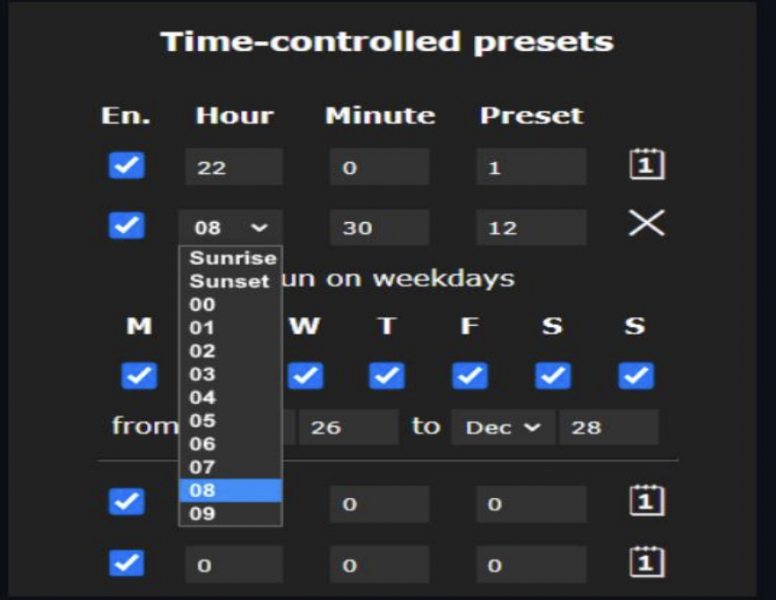
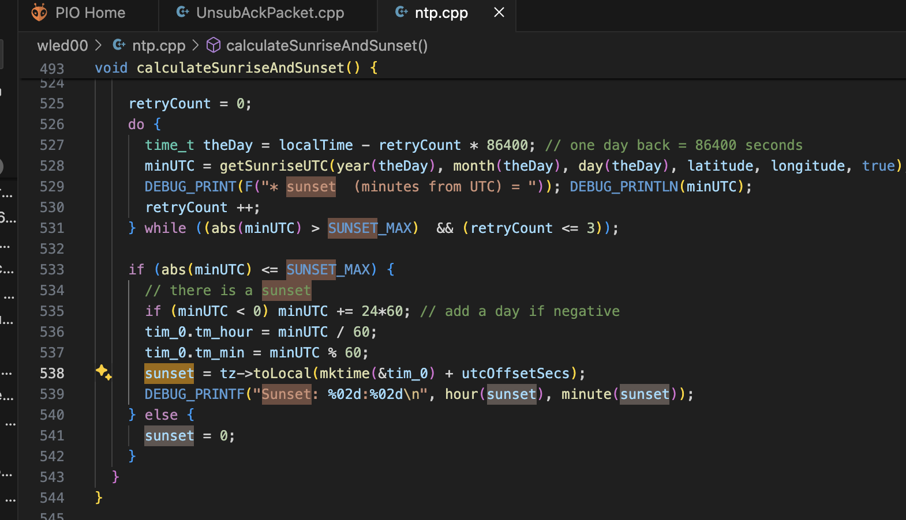
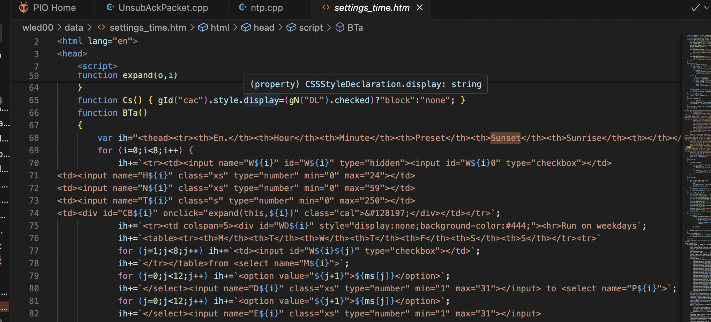
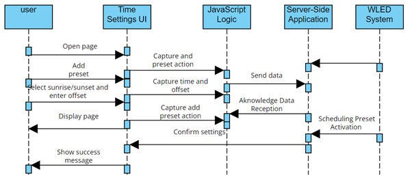

# Issue: #2914 Sunrise/Sunset for all time-controlled presets

The issue #2914 is tracked in the WLED project's issue management system. The feature
request is for the WLED user interface to support dynamic lighting control based on the
sunrise and sunset times. Specifically, users want to set lights to turn on or off at a
specified offset from sunrise or sunset times, accommodating the changing daylight
hours throughout the year.

## Requirements
### Application Context

The issue pertains to the WLED web interface used for controlling LED lighting. The web-
based configuration tool needs to offer users the ability to define lighting presets that
automatically adjust based on local sunrise and sunset times.

## User Story
As a user, I want to set my holiday lights to turn on 30 minutes after sunset and turn off
at sunrise each day within a specified date range, so the lights operate autonomously
according to natural light conditions, enhancing the ambiance and saving energy.

## Use Case

1. The user navigates to the 'Time-controlled presets' section in the WLED settings.
2. The user selects 'Sunrise' or 'Sunset' from a dropdown menu within the presets
table.
3. The user sets an offset by entering the number of minutes before or after sunrise
or sunset.
4. The system calculates the switch-on and switch-off times based on the user's
local sunset and sunrise times, adjusted by the user-defined offset.

## Changes to the source code files

The changes on the source code can be checked on the Pull Request #3929.
The fix was applied in the `wled00/data/settings_time.htm` file.
1. Changed the data transfer object so that it can contain sunset and sunrise data
2. Changed the interface so that it has two new selectors for sunset and sunrise
3. Added a validation so that if sunset and sunrise are not empty or null, the
automation time to be considered will be theirs

## Design of the Fix
### Sequence diagram

This diagram represents the interactions between the user interface elements, the
server-side API (for retrieving location-based sunrise and sunset times), and the system
that processes these settings to control the LED lights.
We aim to constitute in the user interface for the time settings in the WLED project. It
includes new form elements for sunrise and sunset time selection, along with JavaScript
functions for dynamically generating UI elements and handling form submissions.

