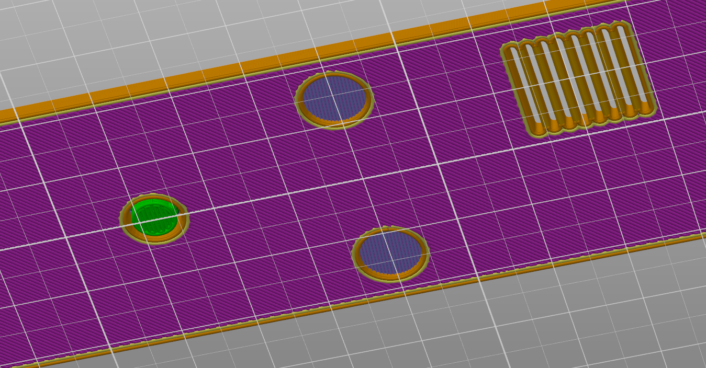
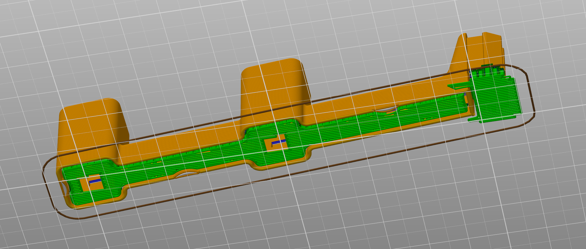
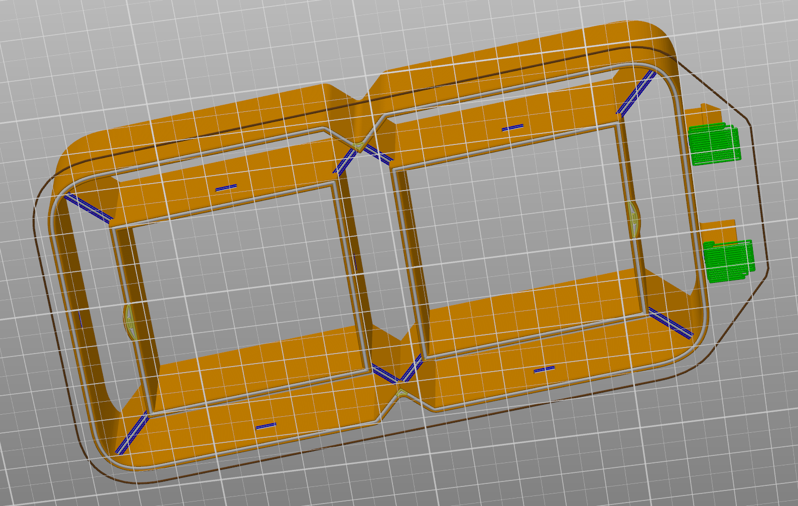
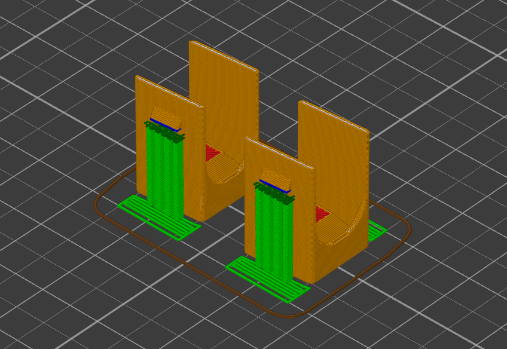
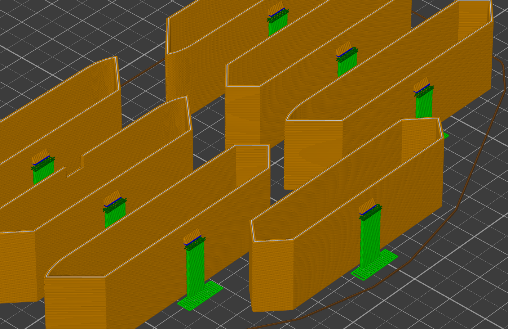

# 3D-print models

Here you can find the 3D-print ready models of the clock. The files also contain PrusaSlicer/SuperSlicer metadata for optimal printing settings and custom support definitions, therefore I highly recommend to use [SuperSlicer](https://github.com/supermerill/SuperSlicer) to slice the models for your printer (v2.4 or later is required).

These tables below show which material to use for which part and how much of it is necessary:

## Approximate opaque material demand:

| Part   | Weight* | Pieces |  Total   | Supports |
|--------|--------:|-------:|---------:|:--------:|
| Base   |     86g |      1 |    86g   |    No    |
| Bottom |     32g |      1 |    32g   |  Manual  |
| Colon  |      9g |      1 |     9g   |  Manual  |
| Digit  |     40g |      4 |   160g   |  Manual  |
|        |         |        | **287g** |          |

*\* Excluding skirt/brim, and supports.*

The above weights were measured using my recommendation for an opaque material: [FiberSatin (black) by Fiberology](https://fiberlogy.com/en/fiberlogy-filaments/fibersatin/).

## Approximate translucent material demand:

| Part    | Weight* | Pieces |   Total   | Supports |
|---------|--------:|-------:|----------:|:--------:|
| Segment |    ~6g  |     28 |   ~168g   |  Manual  |
| Dot     |    ~1g  |      2 |     ~2g   |  Manual  |
|         |         |        | **~170g** |          |

*\* Excluding skirt/brim, and supports.*

The above weights were measured using my recommendation for an opaque material: [PLA Crystal Clear by Fillamentum](https://fillamentum.com/collections/pla-crystal-clear-filament/).

## Custom supports

If you can't use the embedded support information, here are some pictures as a reference to help establish the proper supports (seen with green color):

