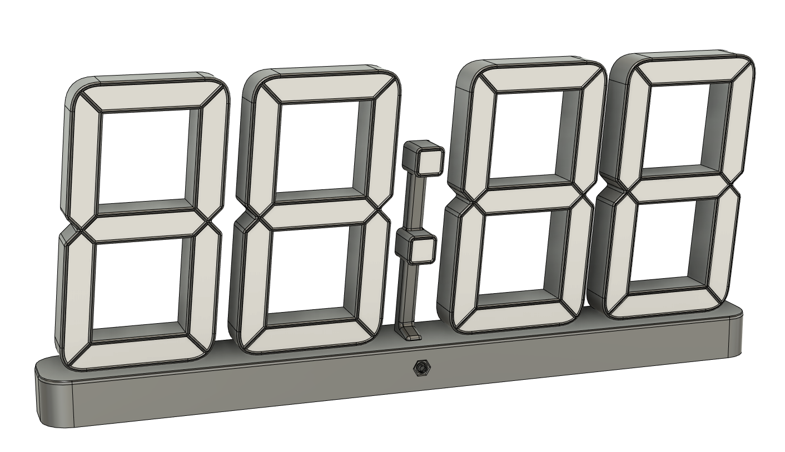

# CAD Models

All designs were made with Fusion360, if you also use it, you only need to open a sigle file that includes everything you need:

- [led-clock.f3z](led-clock.f3z)

Otherwise you may use the STEP files below:

- [assembled.step](assembled.step)
- [base-and-bottom.step](base-and-bottom.step)
- [colon-and-dots.step](colon-and-dots.step)
- [digit-and-segments.step](digit-and-segments.step)

