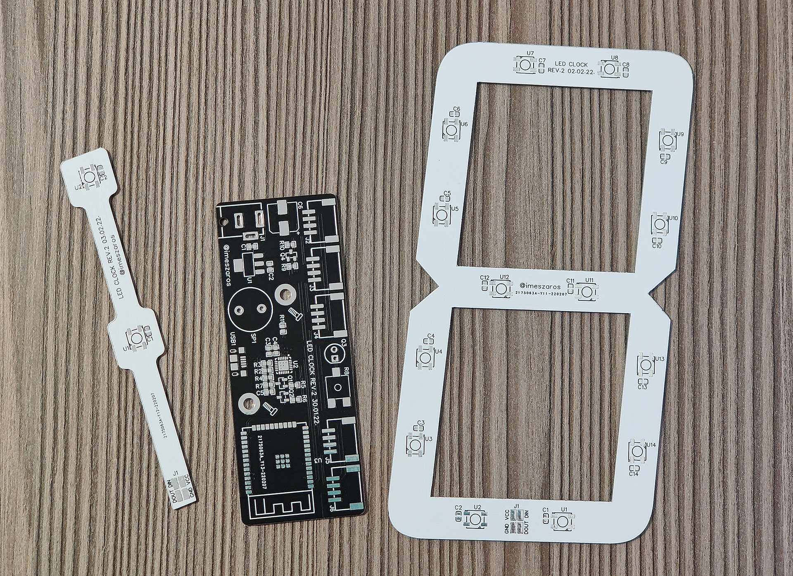

# Schematic and PCB designs

All designs were created with [EasyEDA](https://easyeda.com/). You can import the JSON files in this directory with it if you need to modify them.

The main board has two flavours. In the original design I used SMD connectors but later realized that the THT versions are much cheaper and easier to get, so I also included a version that uses THT connectors.

The *dots* and *digit* PCB design has a THT pad that with a very small hole diameter and fully covered with solder mask. It's a workaround for EasyEDA to get the bottom layer fully covered with copper and solder mask. This is only necessary for aesthetic reasons (to block light shining through and get a nice color instead of the color of the PCB material). Since the bottom layer does not contain anything, it was not exported as a PDF file. If you make your PCB yourself, you can omit the workaround pads completely.

## Main board

- Schematic
  - [EasyEDA](schematic-main-board.json)
  - [PDF](schematic-main-board.pdf)
- PCB
  - SMD connectors
    - [EasyEDA](pcb-main-board-with-smd-connectors.json)
    - [Top layer PDF](pcb-main-board-with-smd-connectors-top.pdf)
    - [Top silk layer PDF](pcb-main-board-with-smd-connectors-top-silk.pdf)
    - [Bottom layer PDF](pcb-main-board-with-smd-connectors-bottom.pdf)
  - THT connectors
    - [EasyEDA](pcb-main-board-with-tht-connectors.json)
    - [Top layer PDF](pcb-main-board-with-tht-connectors-top.pdf)
    - [Top silk layer PDF](pcb-main-board-with-tht-connectors-top-silk.pdf)
    - [Bottom layer PDF](pcb-main-board-with-tht-connectors-bottom.pdf)

## Dots

- Schematic
  - [EasyEDA](schematic-dots.json)
  - [PDF](schematic-dots.pdf)
- PCB
  - [EasyEDA](pcb-dots.json)
  - [Top layer PDF](pcb-dots-top.pdf)
  - [Top silk layer PDF](pcb-dots-top-silk.pdf)

## Digit

- Schematic
  - [EasyEDA](schematic-digit.json)
  - [PDF](schematic-digit.pdf)
- PCB
  - [EasyEDA](pcb-digit.json)
  - [Top layer PDF](pcb-digit-top.pdf)
  - [Top silk layer PDF](pcb-digit-top-silk.pdf)

