# Users guide

This page assumes that you already have the clock fully assembled with the firmware uploaded to it.

- [1. Turning the clock off and on](#1-turning-the-clock-off-and-on)
- [2. Wi-Fi connection](#2-wi-fi-connection)
- [3. Using the smartphone application](#3-using-the-smartphone-application)
- [4. Top buttons](#4-top-buttons)
- [5. Colors, palettes and effects](#5-colors-palettes-and-effects)
- [6. Time and time zone settings](#6-time-and-time-zone-settings)
- [7. Clock features](#7-clock-features)
  - [7.1. Clock](#71-clock)
  - [7.2. Timer](#72-timer)
  - [7.3. Stopwatch](#73-stopwatch)
- [8. Clock Settings](#8-clock-settings)
  - [8.1. Brightness Control](#81-brightness-control)
  - [8.2. Display Settings](#82-display-settings)
  - [8.3. Beeps](#83-beeps)
- [9. Firmware upgrade](#9-firmware-upgrade)
- [10. Help](#10-help)

## 1. Turning the clock off and on

Simply plug / pull the power cord in / out to turn the clock on and off. The control interface also has a *power toggle* button ([see later](#4-top-buttons)) , but it only controls the state of the clock's display.

## 2. Wi-Fi connection

All configuration of the clock is done via a web interface accessible through a Wi-Fi connection. The clock is not connected to any network by default, instead, it turns itself into a wireless access point named *LED Clock AP*.

You can connect to this access point with any device having a web browser. A pop-up will ask to 'log in' to the wireless network, which in fact will open the control interface of the clock.

At this point you can choose from two options:

- Leave the clock in access point mode. This means that each time you would like to change some settings, you need to connect to the clock again. Automatic time synchronization from the internet wont be possible in this mode (time will be synchronized from the device that connects to the clock instead), neither controlling the clock via the [smartphone application](https://github.com/Aircoookie/WLED-App) provided by WLED.

- Go to the Wi-Fi settings and connect the clock to your home wireless network. This enables automatic time synchronization and smartphone app control. You can control the clock from any device connected to the same network by simply opening a web browser and navigating to the clock's IP address. To connect to your network, simply enter the network name and password, then click on the *Save and Connect* button.

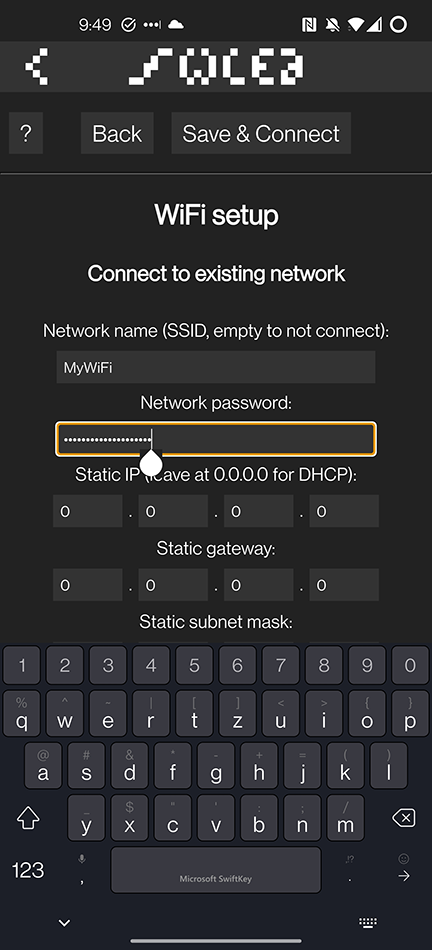

## 3. Using the smartphone application

If you chose to connect the clock to your wireless network, you can use the [smartphone application](https://github.com/Aircoookie/WLED-App) provided by the [WLED](https://github.com/Aircoookie/WLED) project.

Obviously you need to install the application first from the Apple/Play store. Launch the app which will present you an empty list of WLED devices. To add the clock to the list, press the *+*  button at the upper-right corner.

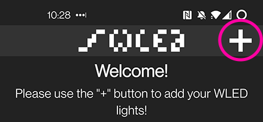

At the *add* screen you can add the clock manually by entering its IP address, but the app can find it automatically by clicking on the *DISCOVER LIGHTS...* button. After the clock has been found, click on the checkmark button at the upper-right corner.

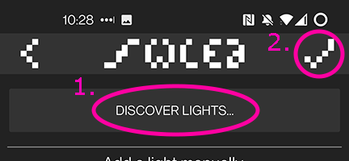

The clock should be now visible in the list. Simply tap on it once to bring its control interface up.

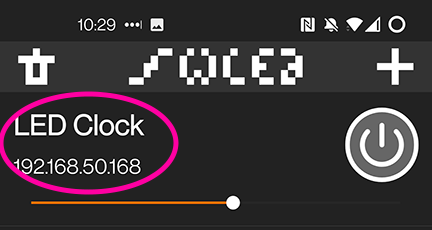

This procedure has to be only done once as long as the IP address of the clock remains the same.

## 4. Top buttons

The upmost part of the control interface shows a button bar:

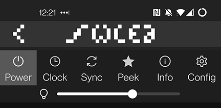

- **Power**: toggles the clock display. Even if the display is turned off, all other functionality of the device continues to work 'in the background'.
- **Clock**: allows access the clock specific features like the timer or stopwatch ([see later](#7-clock-features)).
- **Sync**: if you have multiple WLED based devices in your network you can [synchronize them](https://kno.wled.ge/interfaces/udp-notifier/) to show the same visuals.
- **Peek**: toggles a thin stripe that shows the colors of the display in real time.
- **Info**: shows information about the device and its state.
- **Config**: allows to access various configuration options.

## 5. Colors, palettes and effects

The visuals of the clock display are determined by a **color palette** and an **effect**. The main screen of the control interface allows you to configure these.

On the first tab (Colors) you can select the color palette by choosing it from the many predefined ones or setting up a custom one.

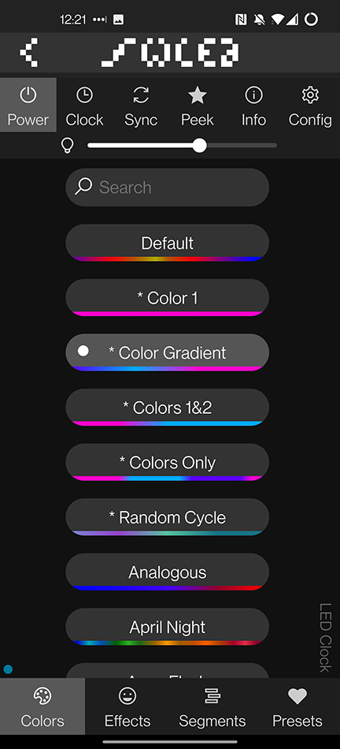

To create a custom palette, tap on one of the following buttons:
- Color 1
- Color Gradient
- Colors 1&2
- Colors Only

Depending on your selection, you can specify either 1, 2, or three custom colors. To specify the color, select one of the circular *1*, *2* or *3* buttons and use the color wheel or one of the color preset buttons to set it.

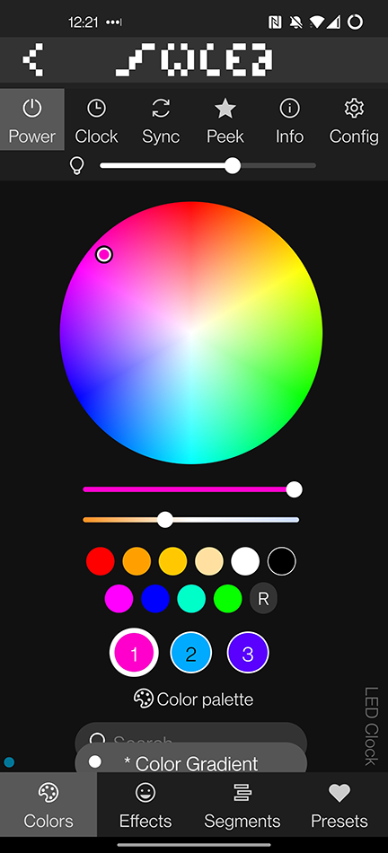

Displaying numbers or symbols works by masking out the output colors. Since masking means setting the appropriate LEDs to *black*, choosing black or very dark colors will interfere with the masking and therefore prevents the proper displaying of numbers or symbols on the display.

To change the effect, go to the second tab (Effects) and choose the desired effect. Each effect has a *speed* setting, and most of the effects have an *intensity* setting as well. What the intensity means is specific to the effect. Note that not all effects are using the current palette. Some effects are using the first and/or second color, or the current palette AND the first and/or second color, etc.

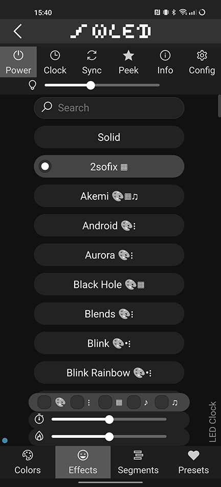

Feel free to play with the settings to create the visuals you are looking for.

On the third tab (Segments) you may split up the display to multiple segments and apply different visuals to each segment. Check the corresponding [WLED documentation](https://kno.wled.ge/features/segments/) to see how this works.

On the fourth tab (Presets) you can create presets of your favorite settings to load them easier. Read on in the [WLED documentation](https://kno.wled.ge/features/presets/).

## 6. Time and time zone settings

Location: **Config / Time & Macros**

By default, the clock synchronizes itself regularly from the internet when connected to a Wi-Fi network, otherwise from the device where it's controlled from.

You can turn off the synchronization from the internet by removing the tick from the *Get time from NTP server* checkbox. Below you can specify an NTP server for the synchronization.

Yo can also choose 12 or 24 hour display format. To show time matching to your physical location, the correct time zone should be set. The default setting is *CET/CEST*, but it can be also set here.

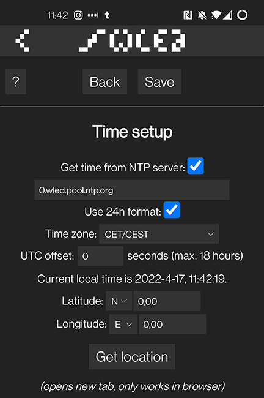

Don't forget to click on the *Save* button the apply your changes.

## 7. Clock features

Click on the *Clock* button in the top button bur to show the control interface for the clock features. Under *Clock Mode* you can choose the current operational mode of the device.

### 7.1. Clock

In this mode the device shows the current local time. You can click on the buttons for various time / clock related configuration options.

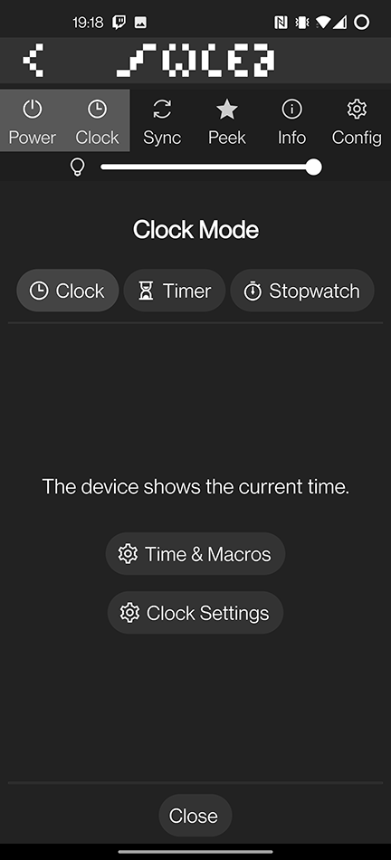

### 7.2. Timer

In this mode you can set an interval, start the timer and the clock will count down to zero.

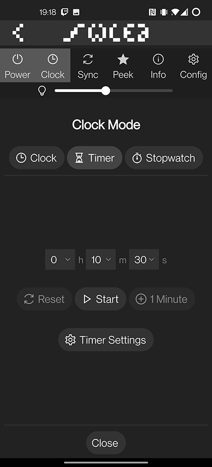

Just tap on one of the drop-downs to set the interval, then tap on *Start* to begin the countdown. You may pause / resume it any time. Clicking on the *Reset* button will stop the countdown and re-sets the original interval. The *+1 Minute* button adds one minute to the remaining time.

### 7.3. Stopwatch

In this mode you can use the clock as a stopwatch.

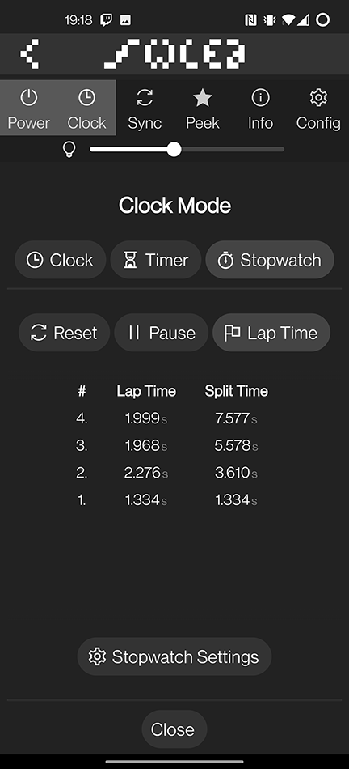

Simply hit the *Start* button to start the counting. You may pause / resume it any time. The *Lap Time* button records an intermediate interval showing the elapsed time since the last lap time recording (or since the start of the counting in the case of the first lap time) and the total elapsed time (splits). Clicking on the *Reset* button will stop the counting and zeroes the counter out, clearing all the lap times as well.

## 8. Clock Settings

Location: **Config / Clock Settings**

All LED Clock specific settings can be configured here.

### 8.1. Brightness Control

The device has an ambient light sensor to be able to automatically adjust the brightness of the display, increasing it in bright environments and decreasing it when the light level drops (i.e. at night). This feature is turned on by default, but you can disable it by removing the checkmark:

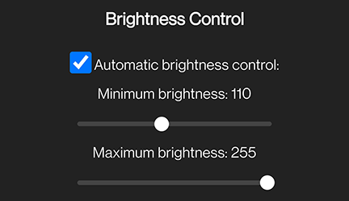

You can also set the minimum and maximum brightness levels (applies only when the automatic brightness control is enabled).

Note that when the automatic brightness control is enabled, you cannot set the brightness level manually using the global *brightness slider*:

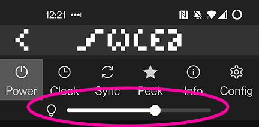

### 8.2. Display Settings

You can control whether leading zero should be displayed or not. If the *Hide leading zero (hours)* is checked, hours before 10 will be shown as **8:35** instead of **08:35**.

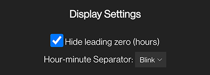

Behavior of the hour-minute separator can be also changed here by selecting it from the *Hour-minute Separator* drop-down.

### 8.3. Beeps

The clock has small buzzer that can beep on various events or provide audible feedback. You can toggle beeping globally with the help of the *Mute all beeps* checkbox.

Below this there are drop-downs to assign a beeping style to various events or functions. Selecting a beep will play it immediately to verify wether it's an appropriate choice or not.

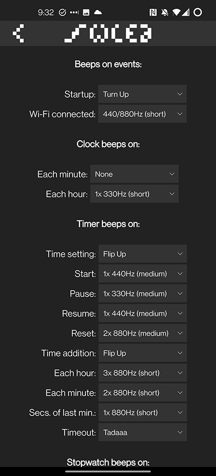

Do not forget to tap on the *Save* button to apply your changes.

## 9. Firmware upgrade

No software is perfect. If you encounter any issues or would like to use new functionality added in a later firmware release, you have to upgrade the clock to the latest firmware revision.

To check which version of the firmware you are running, tap on the *Info* button in the top button bar:

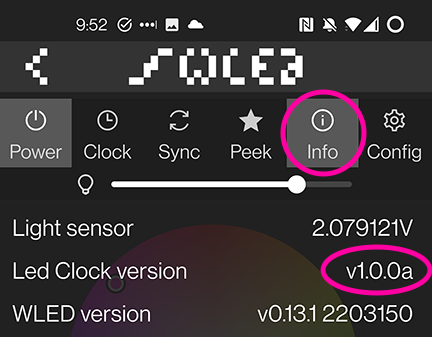

If you need to upgrade, follow the procedure below:

- first download the latest firmware binary from the [releases page](https://github.com/imeszaros/ledclock/releases)
- go to **Config / Security & Updates**
- tap on **Manual OTA Update**
- browse the downloaded firmware binary
- tap on **Update!**
- the update could take around 30-60 seconds, the device will reboot automatically

## 10. Help

Can't find a solution for your problem on this page? Feel free to [contact me](https://github.com/imeszaros).
