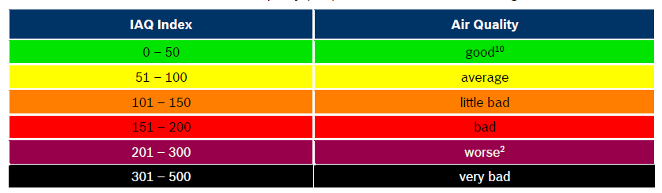

# Usermod BME68X
This usermod was developed for a BME680/BME68X sensor. The BME68X is not compatible with the BME280/BMP280 chip. It has its own library. The original 'BSEC Software Library' from Bosch was used to develop the code. The measured values are displayed on the WLED info page. 

<p align="center"></p>

In addition, the values are published on MQTT if this is active. The topic used for this is: 'wled/[MQTT Client ID]'. The Client ID is set in the WLED MQTT settings.
<p align="center"></p>

If you use HomeAssistance discovery, the device tree for HomeAssistance is created.  This is published under the topic 'homeassistant/sensor/[MQTT Client ID]' via MQTT.
<p align="center"></p>

A device with the following sensors appears in HomeAssistant. Please note that MQTT must be activated in HomeAssistant.
<p align="center"></p>


## Features
Raw sensor types

	Sensor		Accuracy	Scale		Range
 	--------------------------------------------------------------------------------------------------
	Temperature	+/- 1.0		°C/°F		-40 to 85 °C
	Humidity	+/- 3 		%		0 to 100 %
	Pressure	+/- 1 		hPa		300 to 1100 hPa
	Gas Resistance			Ohm

The BSEC Library calculates the following values via the gas resistance

	Sensor		Accuracy	Scale		Range
 	--------------------------------------------------------------------------------------------------
	IAQ 						value between 0 and 500
	Static IAQ 					same as IAQ but for permanently installed devices
	CO2 				PPM
	VOC 				PPM
	Gas-Percentage 			%


In addition the usermod calculates

	Sensor		Accuracy	Scale		Range
 	--------------------------------------------------------------------------------------------------
	Absolute humidity	 	g/m³
	Dew point 			°C/°F

### IAQ (Indoor Air Quality)
The IAQ is divided into the following value groups. 
<p align="center"></p>

For more detailed information, please consult the enclosed Bosch product description (BME680.pdf).


## Calibration of the device

The gas sensor of the BME68X must be calibrated. This differs from the BME280, which does not require any calibration. 
There is a range of additional information for this, which the driver also provides. These values can be found in HomeAssistant under Diagnostics.

- **STABILIZATION_STATUS**: Gas sensor stabilization status [boolean] Indicates initial stabilization status of the gas sensor element: stabilization is ongoing (0) or stabilization is finished (1).
- **RUN_IN_STATUS**: 	Gas sensor run-in status [boolean] Indicates power-on stabilization status of the gas sensor element: stabilization is ongoing (0) or stabilization is finished (1)

Furthermore, all GAS based values have their own accuracy value. These have the following meaning: 

- **Accuracy = 0** 	means the sensor is being stabilized (this can take a while on the first run) 
- **Accuracy = 1**	means that the previous measured values show too few differences and cannot be used for calibration. If the sensor is at accuracy 1 for too long, you must ensure that the ambient air is chaning. Opening the windows is fine. Or sometimes it is sufficient to breathe on the sensor for approx. 5 minutes. 
- **Accuracy = 2**	means the sensor is currently calibrating.
- **Accuracy = 3**	means that the sensor has been successfully calibrated. Once accuracy 3 is reached, the calibration data is automatically written to the file system. This calibration data will be used again at the next start and will speed up the calibration.

The IAQ index is therefore only meaningful if IAQ Accuracy = 3. In addition to the value for IAQ, BSEC also provides us with CO2 and VOC equivalent values. When using the sensor, the calibration value should also always be read out and displayed or transmitted.

Reasonably reliable values are therefore only achieved when accuracy displays the value 3.


## Settings
The settings of the usermods are set in the usermod section of wled. 
<p align="center"></p>

The possible settings are

- **Enable:**			Enables / disables the usermod
- **I2C address:**		I2C address of the sensor. You can choose between 0X77 & 0X76. The default is 0x77.
- **Interval:**			Specifies the interval of seconds at which the usermod should be executed. The default is every second. 
- **Pub Chages Only:**		If this item is active, the values are only published if they have changed since the last publication. 
- **Pub Accuracy:**		The Accuracy values associated with the gas values are also published. 
- **Pub Calib State:**		If this item is active, STABILIZATION_STATUS& RUN_IN_STATUS are also published. 
- **Temp Scale:**		Here you can choose between °C and °F.
- **Temp Offset:**		The temperature offset is always set in °C. It must be converted for Fahrenheit. 
- **HA Discovery:**		If this item is active, the HomeAssistant sensor tree is created. 
- **Pause While WLED Active:**	If WLED has many LEDs to calculate, the computing power may no longer be sufficient to calculate the LEDs and read the sensor data. The LEDs then hang for a few microseconds, which can be seen. If this point is active, no sensor data is fetched as long as WLED is running.
- **Del Calibration Hist:**	If a check mark is set here, the calibration file saved in the file system is deleted when the settings are saved. 

### Sensors
Applies to all sensors. The number of decimal places is set here. If the sensor is set to -1, it will no longer be published. In addition, the IAQ values can be activated here in verbal form. 

It is recommended to use the Static IAQ for the IAQ values. This is recommended by Bosch for statically placed devices.

## Output

Data is published over MQTT - make sure you've enabled the MQTT sync interface.

In addition to outputting via MQTT, you can read the values from the Info Screen on the dashboard page of the device's web interface.

Methods also exist to read the read/calculated values from other WLED modules through code.
- getTemperature();	The scale °C/°F is depended to the settings
- getHumidity();	
- getPressure();
- getGasResistance();
- getAbsoluteHumidity();
- getDewPoint();		The scale °C/°F is depended to the settings
- getIaq();
- getStaticIaq();
- getCo2();
- getVoc();
- getGasPerc();
- getIaqAccuracy();
- getStaticIaqAccuracy();
- getCo2Accuracy();
- getVocAccuracy();
- getGasPercAccuracy();
- getStabStatus();
- getRunInStatus();


## Compiling

To enable, compile with `USERMOD_BME68X` defined (e.g. in `platformio_override.ini`) and add the `BSEC Software Library` to the lib_deps.

```
[env:esp32-BME680]
board = 		esp32dev
platform = 		${esp32.platform}
platform_packages = 	${esp32.platform_packages}
lib_deps = 		${esp32.lib_deps}
           		boschsensortec/BSEC Software Library @ ^1.8.1492      	; USERMOD: BME680                                          
build_unflags = 	${common.build_unflags}
build_flags = 		${common.build_flags_esp32} 
              		-D USERMOD_BME68X                      			; USERMOD: BME680
```

## Revision History
### Version 1.0.0
- First version of the BME68X_v user module
### Version 1.0.1
- Rebased to WELD Version 0.15
- Reworked some default settings
- A problem with the default settings has been fixed

## Known problems
- MQTT goes online at device start. Shortly afterwards it goes offline and takes quite a while until it goes online again. The problem does not come from this user module, but from the WLED core.
- If you save the settings often, WLED can get stuck.
- If many LEDS are connected to WLED, reading the sensor can cause a small but noticeable hang. The "Pause While WLED Active" option was introduced as a workaround.

<div> </div>
Gabriel Sieben (gsieben@geogab.net)
