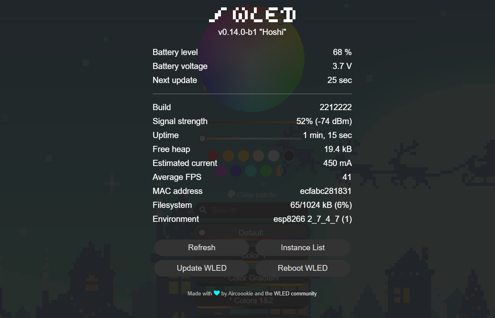

  

# Welcome to the battery usermod! 🔋

Enables battery level monitoring of your project.

  

 

## ⚙️ Features

- 💯 Displays current battery voltage
- 🚥 Displays battery level
- 🚫 Auto-off with configurable threshold
- 🚨 Low power indicator with many configuration possibilities

  

## 🎈 Installation

| **Option 1** | **Option 2** |
|--------------|--------------|
| In `wled00/my_config.h` Add the line: `#define USERMOD_BATTERY`  [Example: my_config.h](assets/installation_my_config_h.png) | In `platformio_override.ini` (or `platformio.ini`) Under: `build_flags =`, add the line: `-D USERMOD_BATTERY`  [Example: platformio_override.ini](assets/installation_platformio_override_ini.png) |

  

## 🔌 Example wiring

- (see [Useful Links](#useful-links)).

<table style="width: 100%; table-layout: fixed;">
<tr>
  <!-- Column for the first image -->
  <td style="width: 50%; vertical-align: bottom;">
    
    
<strong>ESP8266</strong> 
      With a 100k Ohm resistor, connect the positive 
      side of the battery to pin `A0`.

  </td>
  <!-- Column for the second image -->
  <td style="width: 50%; vertical-align: bottom;">
    
    
<strong>ESP32</strong> (+S2, S3, C3 etc...) 
      Use a voltage divider (two resistors of equal value). 
      Connect to ADC1 (GPIO32 - GPIO39). GPIO35 is Default.

  </td>
</tr>
</table>

  

## Define Your Options

| Name                                            | Unit        | Description                                                                           |
| ----------------------------------------------- | ----------- |-------------------------------------------------------------------------------------- |
| `USERMOD_BATTERY`                               |             | Define this (in `my_config.h`) to have this usermod included wled00\usermods_list.cpp |
| `USERMOD_BATTERY_MEASUREMENT_PIN`               |             | Defaults to A0 on ESP8266 and GPIO35 on ESP32                                         |
| `USERMOD_BATTERY_MEASUREMENT_INTERVAL`          | ms          | Battery check interval. defaults to 30 seconds                                        |
| `USERMOD_BATTERY_INITIAL_DELAY`                 | ms          | Delay before initial reading. defaults to 10 seconds to allow voltage stabilization   |
| `USERMOD_BATTERY_{TYPE}_MIN_VOLTAGE`            | v           | Minimum battery voltage. default is 2.6 (18650 battery standard)                      |
| `USERMOD_BATTERY_{TYPE}_MAX_VOLTAGE`            | v           | Maximum battery voltage. default is 4.2 (18650 battery standard)                      |
| `USERMOD_BATTERY_{TYPE}_TOTAL_CAPACITY`         | mAh         | The capacity of all cells in parallel summed up                                       |
| `USERMOD_BATTERY_{TYPE}_CALIBRATION`            |             | Offset / calibration number, fine tune the measured voltage by the microcontroller    |
| Auto-Off                                        | ---         | ---                                                                                   |
| `USERMOD_BATTERY_AUTO_OFF_ENABLED`              | true/false  | Enables auto-off                                                                      |
| `USERMOD_BATTERY_AUTO_OFF_THRESHOLD`            | % (0-100)   | When this threshold is reached master power turns off                                 |
| Low-Power-Indicator                             | ---         | ---                                                                                   |
| `USERMOD_BATTERY_LOW_POWER_INDICATOR_ENABLED`   | true/false  | Enables low power indication                                                          |
| `USERMOD_BATTERY_LOW_POWER_INDICATOR_PRESET`    | preset id   | When low power is detected then use this preset to indicate low power                 |
| `USERMOD_BATTERY_LOW_POWER_INDICATOR_THRESHOLD` | % (0-100)   | When this threshold is reached low power gets indicated                               |
| `USERMOD_BATTERY_LOW_POWER_INDICATOR_DURATION`  | seconds     | For this long the configured preset is played                                         |

All parameters can be configured at runtime via the Usermods settings page.

 

**NOTICE:** Each Battery type can be pre-configured individualy (in `my_config.h`)

| Name            | Alias         | `my_config.h` example                 |
| --------------- | ------------- | ------------------------------------- |
| Lithium Polymer | lipo (Li-Po)  | `USERMOD_BATTERY_lipo_MIN_VOLTAGE`    |
| Lithium Ionen   | lion (Li-Ion) | `USERMOD_BATTERY_lion_TOTAL_CAPACITY` |

  

## 🔧 Calibration

The calibration number is a value that is added to the final computed voltage after it has been scaled by the voltage multiplier. 

It fine-tunes the voltage reading so that it more closely matches the actual battery voltage, compensating for inaccuracies inherent in the voltage divider resistors or the ESP's ADC measurements.

Set calibration either in the Usermods settings page or at compile time in `my_config.h` or `platformio_override.ini`.

It can be either a positive or negative number.

  

## ⚠️ Important

Make sure you know your battery specifications! All batteries are **NOT** the same!

Example:

| Your battery specification table  |                 | Options you can define        |
| --------------------------------- | --------------- | ----------------------------- |
| Capacity                          | 3500mAh 12.5Wh  |                               |
| Minimum capacity                  | 3350mAh 11.9Wh  |                               |
| Rated voltage                     | 3.6V - 3.7V     |                               |
| **Charging end voltage**          | **4.2V ± 0.05** | `USERMOD_BATTERY_MAX_VOLTAGE` |
| **Discharge voltage**             | **2.5V**        | `USERMOD_BATTERY_MIN_VOLTAGE` |
| Max. discharge current (constant) | 10A (10000mA)   |                               |
| max. charging current             | 1.7A (1700mA)   |                               |
| ...                               | ...             | ...                           |
| ..                                | ..              | ..                            |

Specification from: [Molicel INR18650-M35A, 3500mAh 10A Lithium-ion battery, 3.6V - 3.7V](https://www.akkuteile.de/lithium-ionen-akkus/18650/molicel/molicel-inr18650-m35a-3500mah-10a-lithium-ionen-akku-3-6v-3-7v_100833)

  

## 🌐 Useful Links

- https://lazyzero.de/elektronik/esp8266/wemos_d1_mini_a0/start
- https://arduinodiy.wordpress.com/2016/12/25/monitoring-lipo-battery-voltage-with-wemos-d1-minibattery-shield-and-thingspeak/

  

## 📝 Change Log

2024-08-19

- Improved MQTT support
- Added battery percentage & battery voltage as MQTT topic

2024-05-11

- Documentation updated

2024-04-30

- Integrate factory pattern to make it easier to add other / custom battery types
- Update readme
- Improved initial reading accuracy by delaying initial measurement to allow voltage to stabilize at power-on

2023-01-04

- Basic support for LiPo rechargeable batteries (`-D USERMOD_BATTERY_USE_LIPO`)
- Improved support for ESP32 (read calibrated voltage)
- Corrected config saving (measurement pin, and battery min/max were lost)
- Various bugfixes

2022-12-25

- Added "auto-off" feature
- Added "low-power-indication" feature
- Added "calibration/offset" field to configuration page
- Added getter and setter, so that user usermods could interact with this one
- Update readme (added new options, made it markdownlint compliant)

2021-09-02

- Added "Battery voltage" to info
- Added circuit diagram to readme
- Added MQTT support, sending battery voltage
- Minor fixes

2021-08-15

- Changed `USERMOD_BATTERY_MIN_VOLTAGE` to 2.6 volt as default for 18650 batteries
- Updated readme, added specification table

2021-08-10

- Created
