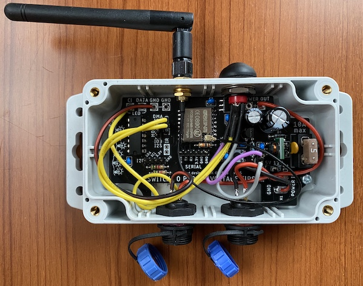

# Almost universal controller board for outdoor applications
This usermod is using ideas from @mrVanboy and @400killer

Installation of file: Copy and replace file in wled00 directory.

For BME280 sensor use usermod_bme280.cpp. Copy to wled00 and rename to usermod.cpp

## Project repository
-   [Original repository](https://github.com/srg74/Controller-for-WLED-firmware) - Main controller repository
## Features
-   SSD1306 128x32 and 128x64 I2C OLED display
-   On screen IP address, SSID and controller status (e.g. ON or OFF, recent effect)
-   Auto display shutoff for saving display lifetime
-   Dallas temperature sensor
-   Reporting temperature to MQTT broker

## Hardware


## Functionality checked with
-   ESP-07S
-   PlatformIO
-   SSD1306 128x32 I2C OLED display
-   DS18B20 (temperature sensor)
-   BME280 (temperature, humidity and pressure sensor)
-   KY-022 (infrared receiver)
-   Push button (N.O. momentary switch)

For Dallas sensor uncomment `U8g2@~2.27.3`,`DallasTemperature@~3.8.0`,`OneWire@~2.3.5 under` `[common]` section in `platformio.ini`:
```ini
# platformio.ini
...
[platformio]
...
default_envs = esp07
; default_envs = d1_mini
...
[common]
...
lib_deps_external =
  ...
  #For use SSD1306 OLED display uncomment following
  U8g2@~2.27.3
  #For Dallas sensor uncomment following 2 lines
  DallasTemperature@~3.8.0
  OneWire@~2.3.5
...
```

For BME280 sensor uncomment `U8g2@~2.27.3`,`BME280@~3.0.0 under` `[common]` section in `platformio.ini`:
```ini
# platformio.ini
...
[platformio]
...
default_envs = esp07
; default_envs = d1_mini
...
[common]
...
lib_deps_external =
  ...
  #For use SSD1306 OLED display uncomment following
  U8g2@~2.27.3
  #For BME280 sensor uncomment following
  BME280@~3.0.0
...
```
