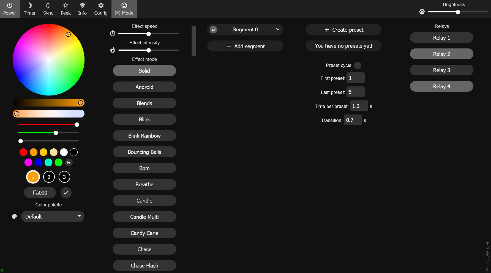
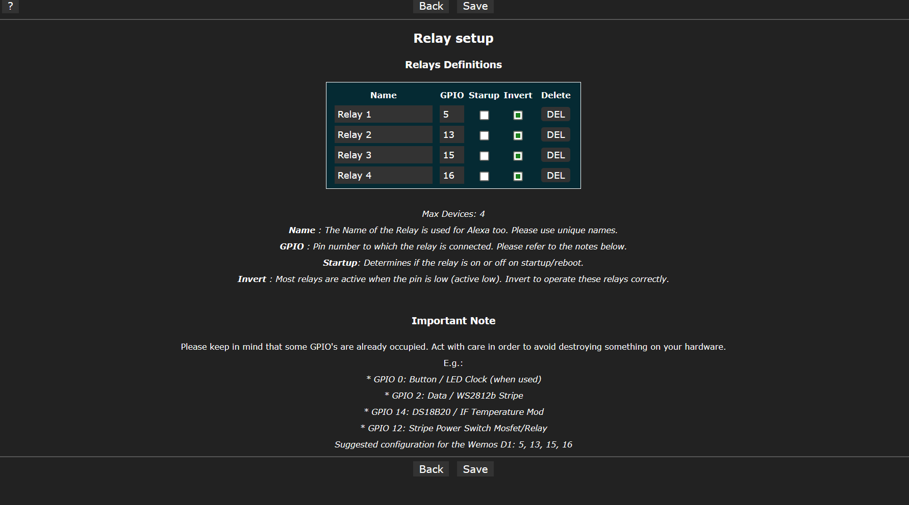

# Usermod GeoGab-Relays

+++ 31/12/2020 by Gabriel Sieben (GeoGab) +++

Version 0.1.0

Extends WLED with a function to control relays via all available interfaces (MQTT / Alexa / Webinterface / APP  / JSON API / HTTP API).
The code was written for the ESP8266 D1 Mini and may have to be adapted to other devices. Currently the number of maximum relays  
limited to 4 by the code. If you need more, you have to increase the value of MAXRELAYS in the build flag set in file `platformio_override.ini` or `platformio.ini`.

# ToDo's
    * MQTT  Function
    * ALEXA Function

!!!!!!!!!!!!!!!!!!!!! Attention. Not yet fully tested !!!!!!!!!!!!!!!!!!!!!

# PINS

The pins for this usermod are defined while configuration (Webpage or JSON)

If you want to connect a relay, search for the appropriate circuit on the web. By default, the relays are set to LowActive. To reverse this, there is a corresponding define (GEOGAB_ACTIVEHIGH). Please also note: https://github.com/Aircoookie/WLED/wiki/Control-a-relay-with-WLED

Pinsetting ON a D1 Mini Device (as an example): 
  - D0 (GPIO 16): Relay 1
  - D1 (GPIO 5):  Relay 2
  - D2 (GPIO 4):  IR Remote
  - D3 (GPIO 0):  Button / LED Clock (when used)
  - D4 (GPIO 2):  Data / WS2812b Stripe
  - D5 (GPIO 14): DS18B20 / IF Temperature Mod
  - D6 (GPIO 12): Stripe Power Switch Relay / Mosfet circuit (Should be preferred)
  - D7 (GPIO 13): Relay 3
  - D8 (GPIO 15): Relay 4

# Integration of the usermod
I have tried to intervene as little as possible in the main code. Unfortunately, however, some interventions in the main code are still necessary. However, it shows very well which functions might still be advantageous for such a deep integration.

## Step I
Add the corresponding lines in the file: `wled00\usermods_list.cpp`. An example of the necessary lines is in the file `usermods_list.cpp` in this folder. 

## Step II 
Add the corresponding Defines in `platform_override.ini` or `platform.ini`. An example of the file: `platformio_override.ini` is in this folder. It can also be simply copied to the root directory (the directory where `platformio.ini` is). The necessary build flag are:`build_flags = ${common.build_flags_esp8266} -D USERMOD_GEOGAB -D MAXRELAYS=4` (While 4 defines the maximum number of relays)

## Step III
Perform the following changes:
    
    1.      Modify the core files:

    1.1         File: `wled00/data/index.hmt` 
                    * Search for: `<button class="tablinks" onclick="openTab(3)">"` ...
                      Add after:  `<button class="tablinks" onclick="openTab(4)"><i class="icons">&#xe0bb;</i>
Relays
</button>`

                    * Search for: `
`
                      Add after the closing 
 of that div section:
                                  `

                                    
Relays

                                    
Loading...

                                  
`

    1.2         File: `wled00/data/index.css`             
                    * Search for: `.bot button {`
                      Change value of width to 20% (2 rows down): `width:25%` => `witdth:20%`

    1.3         File: `wled00/data/index.js`  
                    * Search for: `const _C = document.querySelector('.container'), N = 4;`
                      Replace by: `const _C = document.querySelector('.container'), N = 5;`
                    
                    * Search for: `_C.style.width = (pcMode)?'100%':'400%';`
                      Replace by: `_C.style.width = (pcMode)?'100%':'500%';`

                    * Search for: `if (!command) d.getElementById('Effects')`
                      Add the following above the found line:
                      		/*****  GeoGab Relays: Start *****/
                          var e3 = d.getElementById('ListOfRelays');
                          var norelays=s.relays.no;						// Number of relays (can be undefined too)
                          var cont="";

                          if(norelays) {
                            for (i=0; i<norelays; i++ ) {
                              cont+= '<button class="btn';
                              if (s.relays.status[i]) cont+= ' active';
                              cont+= '" onclick="RelayToggle('+i+','+norelays+');">'+s.relays.name[i]+'</button> ';
                            }
                            e3.innerHTML=cont;

                          } else {
                            e3.innerHTML='<button class="btn btn-s btn-i" onclick="RelaySettings()"><i class="icons btn-icon">&#xe18a;</i>Add Relays</button> ';
                                    
                          }
                          /***** GeoGab Relays: END *****/

                    * Search for: `function togglePower()`
                      Add the following above the line:
                      /***** GeoGab Relays Fuctions: Start *****/
                      function RelaySettings() {
                        window.open("/settings/relays","_self");
                      }

                      function RelayToggle(no,anz){
                        // {"relays":{"toggle":[0,0,0,....]}}
                        var arr=[];

                        for (var i = 0; i<anz ; i++) {
                          i==no ? arr[i]=1 : arr[i]=0 ;
                        }

                        var obj = {"relays":{"toggle":arr}};
                        requestJson(obj);
                      }
                      /***** GeoGab Relays Fuctions: End *****/

    1.4         File: `wled00/data/settings.htm`  
                    * Search for: `<body onload="BB()">`
                    * Insert on your prefered position: `<form action="/settings/relays"><button type="submit">Relay Setup</button></form>`

    1.5         File: `wled00/data/wled_server.cpp`
                    * Search for: `  } else subPage = 255; //welcome page`
                    * Add above the line: `else if (url.indexOf("relay") > 0) subPage = 8;       // GeoGab-Relays Usermod` 

                    * Search for: `case 7: strcpy_P`
                    * Add below the line: `case 8: strcpy_P(s, PSTR("Relay")); break;          // GeoGab-Relays Usermod`

                    * Search for: `case 7:   request`
                    * Add below the line: `case 8:   request->send_P(200, "text/html", PAGE_settings_relay ); break; `

    1.6         File: `tools/cdata.js`
                    * Search for: `  "wled00/html_settings.h"`
                    * Insert 2 Lines above: 
                    `
                        {
                          file: "../../usermods/GeoGab-Relays/settings_relay.htm",
                          name: "PAGE_settings_relay",
                          prepend: "=====(",
                          append: ")=====",
                          method: "plaintext",
                          filter: "html-minify",
                          mangle: (str) =>
                            str
                              // .replace(/\<link rel="stylesheet".*\>/gms, "")
                              // .replace(/\<style\>.*\<\/style\>/gms, "%CSS%%SCSS%")
                              // .replace(                           // Not needed since I transfer the settings via JSON. 
                              //  /function GetV().*\<\/script\>/gms,
                              //  "function GetV() {var d=document;\n"
                              //),
                        },
                    `

    1.7         File: `wled00/my_config.h` 
                    * Place on the End of the file: `#define MAXRELAYS 4`

    1.8         File: `wled00/wleh.h`
                    * Search for: `#define ESPALEXA_MAXDEVICES 1`
                    * Replace with: `#define ESPALEXA_MAXDEVICES MAXRELAYS`

    1.9         File: `wled00/const.h`
                    * Search for: `#define USERMOD_ID_IMU`
                    * Add after:  `#define USERMOD_ID_GEOGABRELAY    7            //Usermod "Usermod_geogab_relay"`

    2.      Compile the changes as mentioned in: https://github.com/Aircoookie/WLED/wiki/Add-own-functionality#changing-web-ui
            To do this, perform the following steps.

    2.1.    Install the Software: https://nodejs.org/en/download/ (only once)

    2.2.    Run in Command Line: npm install (only once)

    2.3.    Run in Command Line: npm run build

## Step IV 
Compile and flash....

## Step V  
Run your Device
1. Setup your Relay in the Webfrondend or using json. 
2. Have fun with your extended relay function.

# Usage
## Webpage: Use the new page/column `Relays`
I think/hope the use of the web user interface is self-explanatory. 
Configure your relays in the web interface (preferred methode). Alternatively, they can also be defined via JSON (see JSON API).

## ALEXA
Not implemented yet.
Use the relay names for Alexa. Please note: To use the relays with Alexa, the device must be restarted after the relay setup. 

## HTTP API
All responses are returned as JSON. 

Status Request: `http://[device-ip]/relays`
Switch Command: `http://[device-ip]/relays?switch=1,0,1,1`   
The number of numbers behind the switch parameter must correspond to the number of relays. The number 1 switches the relay on. The number 0 switches the relay off. 

Toggle Command: `http://[device-ip]/relays?toggle=1,0,1,1`
The number of numbers behind the parameter switch must correspond to the number of relays. The number 1 causes a toggling of the relay. The number 0 leaves the state of the device.

Examples
1. 4 relays at all, relay 2 will be toggled: `http://[device-ip]/relays?toggle=0,1,0,0`
2. 3 relays at all, relay 1&3 will be switched on: `http://[device-ip]/relays?switch=1,0,1`

## JSON API 
### The Json API has two functionalities. 

 - The relays can be switched/controlled
 - The relays can be defined (setup). This is very convenient if you want to provide several devices with the same configuration. 

#### Control 
Fuction | JSON example | Comment
-------- | ----------- | ------------
switch | {"relays":{"switch":[0,0,0,0]}} | Sets the state of all relais
toggle | {"relays":{"toggle":[0,0,0,0]}} | 1: toggles the relay, 0: keeps the status untouched
on | {"relays":{"on":[0,0,0,0]}} | 1: Turns the relay on, 0: keeps the status untouched
off | {"relays":{"off":[0,0,0,0]}} | 1: Turns the relay off, 0: keeps the status untouched
  
The `array [0,0,...]` must match correspond to the number of relays. Otherwise the command is discarded. 

In the folder `examples` you can find an example of a fow in `Red Node`. This also works via json. 

  
  
#### Setup (perfered methode is the web interface)
Be careful when configuring with JSON. There is no error detection. Think very carefully. Incorrect settings can put the device out of operation. In the worst case the hardware can be damaged. 

Structure of json setup example: 

    - 4 Relays (Dev1,gpio:16,Boot Status off, LowActive,...) 
      Send to [Device-IP]/json/status: 
          {"relays":{"config":1,"no":4,"name":["Dev1","Dev2","Dev3","Dev4"],"gpio":[16,5,13,15],"sactive":[0,0,0,0],"invert":[1,1,1,1]}}
    
    - 1 Relay (Dev1,gpio:16,Boot Status off, HighActiv): 
      Send to [Device-IP]/json/status: 
          {"relays":{"config":1,"no":1,"name":["Dev1"],"gpio":[16],"sactive":[0],"invert":[1]}}
          
#### Status
The relay states are part of the JSON response.
 - http://[Device-IP]/json/status -> Shows the current switching state of the relays and the settings. 
 - http://[Device.IP]/json/info   -> Shows the current switching state of the relays.

## MQTT 
Not implemented yet. 
