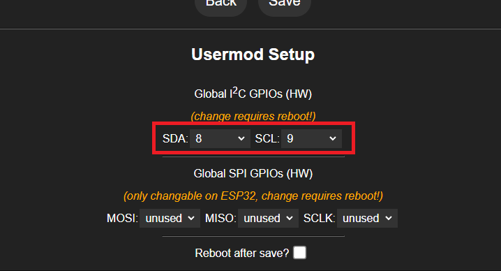
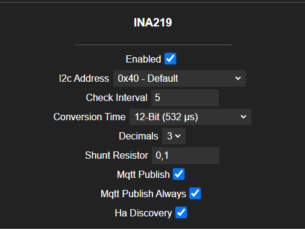

# INA219 WLED Usermod

This Usermod integrates the INA219 sensor with WLED to monitor energy consumption. It can read voltage, current, power, and calculate daily, monthly and total energy usage.

## Features

- Monitors bus voltage, shunt voltage, current, and power.
- Calculates total energy consumed in kilowatt-hours (kWh).
- Supports MQTT publishing of sensor data.
- Publishes energy data to Home Assistant for easy integration.
- Displays daily, monthly and total energy used in the WLED GUI under the info section.
- Configurable through WLED's web interface.

## Screenshots

### Info and Home Assistant

| Info screen                                    | Home Assistant                                                 |
|------------------------------------------------|----------------------------------------------------------------|
|    |     |

### Settings - Pin Selection and Usermod

| Settings page - Pin Selection                                               |  Settings page - Usermod                                     |
|-----------------------------------------------------------------------------|--------------------------------------------------------------|
|  |  |

## Configuration Parameters

| Parameter                     | Description                                                | Default Value  | Possible Values                                        |
|-------------------------------|------------------------------------------------------------|----------------|--------------------------------------------------------|
| `INA219_ENABLED`              | Enable or disable the INA219 Usermod                       | `false`        | `true`, `false`                                        |
| `INA219_I2C_ADDRESS`          | I2C address of the INA219 sensor                           | `0x40`         | See options below for available addresses.             |
| `INA219_CHECK_INTERVAL`       | Interval for checking sensor values (seconds)              | `5`            | Any positive integer                                   |
| `INA219_CONVERSION_TIME`      | ADC conversion time (12-bit, 16-bit, etc.)                 | `BIT_MODE_12`  | See options below for available modes.                 |
| `INA219_DECIMAL_FACTOR`       | Number of decimal places for current and power readings    | `3`            | See options below for decimal places.                  |
| `INA219_SHUNT_RESISTOR`       | Value of the shunt resistor in ohms                        | `0.1`          | Any positive float value matching your INA219 resistor |
| `INA219_CORRECTION_FACTOR`    | Correction factor for measurements                         | `1.0`          | Any positive float value                               |
| `INA219_MQTT_PUBLISH`         | Publish sensor data to MQTT                                | `false`        | `true`, `false`                                        |
| `INA219_MQTT_PUBLISH_ALWAYS`  | Always publish values, regardless of change                | `false`        | `true`, `false`                                        |
| `INA219_HA_DISCOVERY`         | Enable Home Assistant discovery for sensors                | `false`        | `true`, `false`                                        |

		### Options for `INA219_CONVERSION_TIME`

		The `conversionTime` parameter can be set to the following ADC modes:

		| Value             | Description                |
		|-------------------|----------------------------|
		| `BIT_MODE_9`      | 9-Bit (84 µs)              |
		| `BIT_MODE_10`     | 10-Bit (148 µs)            |
		| `BIT_MODE_11`     | 11-Bit (276 µs)            |
		| `BIT_MODE_12`     | 12-Bit (532 µs)            |
		| `SAMPLE_MODE_2`   | 2 samples (1.06 ms)        |
		| `SAMPLE_MODE_4`   | 4 samples (2.13 ms)        |
		| `SAMPLE_MODE_8`   | 8 samples (4.26 ms)        |
		| `SAMPLE_MODE_16`  | 16 samples (8.51 ms)       |
		| `SAMPLE_MODE_32`  | 32 samples (17.02 ms)      |
		| `SAMPLE_MODE_64`  | 64 samples (34.05 ms)      |
		| `SAMPLE_MODE_128` | 128 samples (68.10 ms)     |

		### Options for `INA219_DECIMAL_FACTOR`

		The `decimalFactor` parameter can be set to:

		| Decimal Places | Value | Example         |
		|----------------|-------|------------------|
		| 0              | 0     | 100              |
		| 1              | 1     | 100.0            |
		| 2              | 2     | 100.00           |
		| 3              | 3     | 100.000          |

		### Options for `INA219_I2C_ADDRESS`

		The `i2cAddress` parameter can be set to the following options:

		| Address             | Description                        | Value   |
		|---------------------|------------------------------------|---------|
		| `0x40`              | 0x40 - Default                     | 0x40    |
		| `0x41`              | 0x41 - A0 soldered                 | 0x41    |
		| `0x44`              | 0x44 - A1 soldered                 | 0x44    |
		| `0x45`              | 0x45 - A0 and A1 soldered          | 0x45    |

## Usage

1. Include this usermod in your WLED project by adding `#define USERMOD_INA219` to the `my_config.h` file.

2. **Dependencies**  
   These libraries must be added under `lib_deps` in your `platformio.ini` (or `platform_override.ini`):
   - `wollewald/INA219_WE@~1.3.8` (by [wollewald](https://github.com/wollewald/INA219_WE))

3. Configure the parameters in the web interface or via the JSON config file.

4. Monitor your energy consumption through the WLED interface or via MQTT.

5. Optional to predefine options:

		#define INA219_ENABLED             false
		#define INA219_I2C_ADDRESS         0x40
		#define INA219_CHECK_INTERVAL      5
		#define INA219_CONVERSION_TIME     BIT_MODE_12 
		#define INA219_DECIMAL_FACTOR      3
		#define INA219_SHUNT_RESISTOR      0.1
		#define INA219_CORRECTION_FACTOR   1.0
		#define INA219_MQTT_PUBLISH        false
		#define INA219_MQTT_PUBLISH_ALWAYS false
		#define INA219_HA_DISCOVERY        false

## Energy Calculation

- **Total Energy** is calculated continuously.
- **Daily Energy** resets after 24 hours.
- **Monthly Energy** resets after 30 days.

To reset daily or monthly energy calculations, you can implement corresponding functions within your main application.

## Dependencies

Before enabling the INA219 usermod, ensure the following requirements are met:

### Required Library  
- [INA219_WE](https://github.com/wollewald/INA219_WE) (Must be installed for INA219 support)

### I2C Configuration (Mandatory)  
The INA219 sensor communicates via I2C, so the SDA and SCL pins must be correctly set before enabling the usermod.

1. Open the **WLED Web Interface**.
2. Go to **Settings → Usermod → Global I2C GPIOs (HW)**.
3. Select the appropriate **SDA** and **SCL** pins for your hardware.
4. Save the settings and **reboot WLED**.

🚀 **After rebooting, you can enable the INA219 usermod in the settings.**