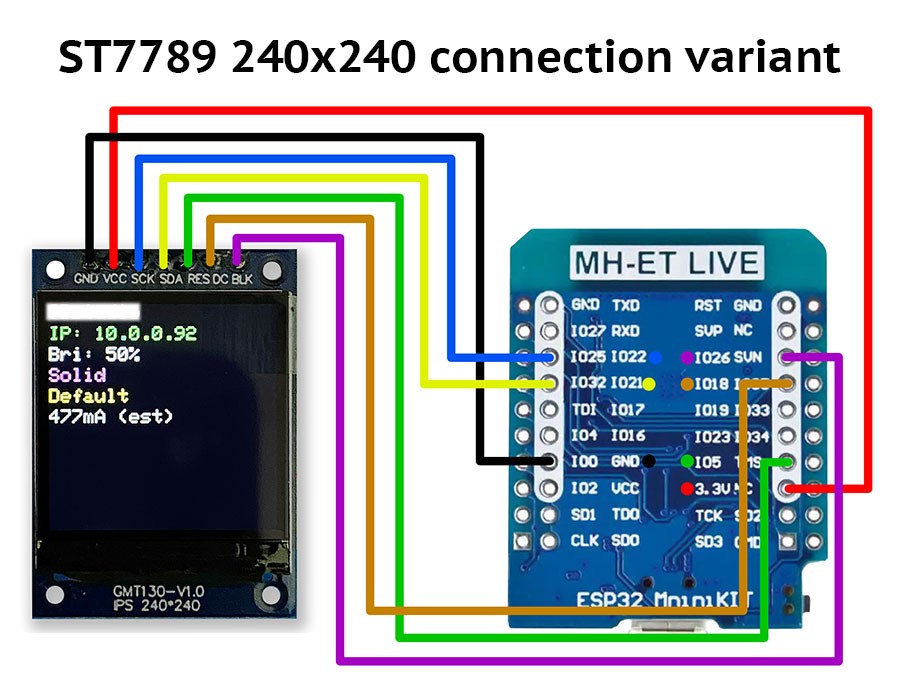

# Using the M5Stick C Plus2

TBA

## Hardware

***

## Library used

[Bodmer/TFT_eSPI](https://github.com/Bodmer/TFT_eSPI)

## Setup

In the `platformio.ini` file, you must change the environment setup to build for just the m5stick platform by uncommenting it.
