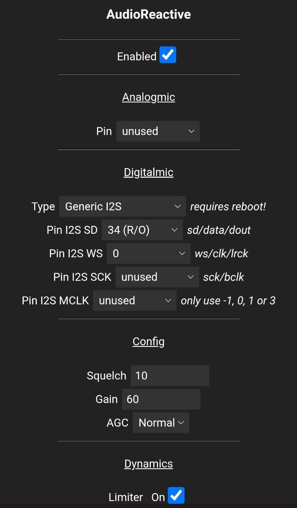
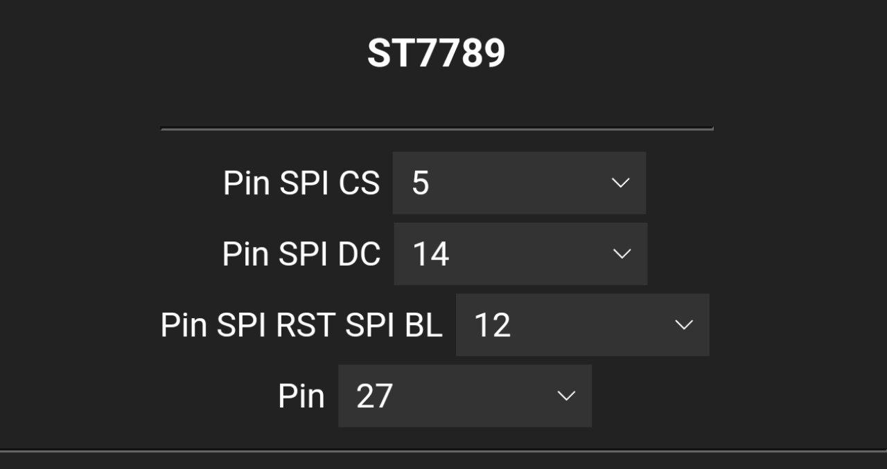

# Using the M5Stick C Plus2
Connect the stick to 5V via your favourite method (USB-C/5V). DO NOT POWER THE LEDS FROM THE STICK OR ITS BATTERY!

## Hardware

***


Connect the data pin of your strips to any of the GPIO pins. Connect GND to any of the GND pins.

## Library used

Used the eSPI TFT library directly, as adding the M5Stack library would cause too much of an overhead.

[Bodmer/TFT_eSPI](https://github.com/Bodmer/TFT_eSPI)

## Setup

In the `platformio.ini` file, you must change the environment setup to build for just the m5stick platform by adding the following target and commeting the other ones:

```
[env:m5stick]
board = esp32dev
build_unflags = ${common.build_unflags}
build_flags = ${common.build_flags_esp32} 
  -D BTNPIN=39
  -D LEDPIN=19
  -D IRPIN=19
  -D WLED_DEBUG=1
  # Display config
  -D ST7789_DRIVER=1
  -D USERMOD_M5STICK2_VISUALISER=1
  -D TFT_WIDTH=135
  -D TFT_HEIGHT=240
  -D TFT_MOSI=15
  -D TFT_BL=27
  -D TFT_SCLK=13
  -D TFT_DC=14
  -D TFT_RST=12
  -D TFT_CS=5
  -D SPI_FREQUENCY=20000000
  -D USER_SETUP_LOADED
  -D USERMOD_AUDIOREACTIVE -D UM_AUDIOREACTIVE_USE_NEW_FFT
lib_deps = 
  ${esp32.lib_deps}
  TFT_eSPI @ ^2.3.70
  https://github.com/kosme/arduinoFFT#419d7b0
platform = ${esp32.platform}
platform_packages = ${esp32.platform_packages}
board_build.partitions = ${esp32.default_partitions}
```

Compile and run. Turn it on, enable the audioreactive mod from the webUI. Make sure the values for the display and I2C mic as follows down below:




