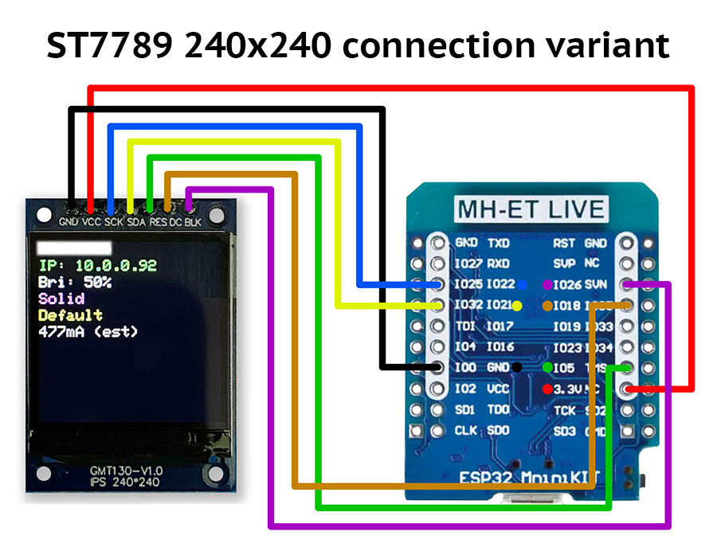

# Using the ST7789 TFT IPS 240x240 pixel color display with ESP32 boards

This usermod enables display of the following:

* Current date and time;
* Network SSID;
* IP address;
* WiFi signal strength;
* Brightness;
* Selected effect;
* Selected palette;
* Effect speed and intensity;
* Estimated current in mA;

## Hardware

***


## Library used

[Bodmer/TFT_eSPI](https://github.com/Bodmer/TFT_eSPI)

## Setup

***

### Platformio.ini changes


In the `platformio.ini` file, you must change the environment setup to build for just the esp32dev platform as follows:

Add the following lines to section:

```ini
default_envs = esp32dev
build_flags = ${common.build_flags_esp32}
  -D USERMOD_ST7789_DISPLAY
    -DUSER_SETUP_LOADED=1
    -DST7789_DRIVER=1
    -DTFT_WIDTH=240
    -DTFT_HEIGHT=240
    -DCGRAM_OFFSET=1
    -DTFT_MOSI=21
    -DTFT_SCLK=22
    -DTFT_DC=27
    -DTFT_RST=26
    -DTFT_BL=14
    -DLOAD_GLCD=1
    ;optional for WROVER
    ;-DCONFIG_SPIRAM_SUPPORT=1
```

Save the `platformio.ini` file.  Once saved, the required library files should be automatically downloaded for modifications in a later step.

### TFT_eSPI Library Adjustments

If you are not using PlatformIO, you need to modify a file in the `TFT_eSPI` library. If you followed the directions to modify and save the `platformio.ini` file above, the `Setup24_ST7789.h` file can be found in the `/.pio/libdeps/esp32dev/TFT_eSPI/User_Setups/` folder.

Edit `Setup_ST7789.h` file and uncomment and change GPIO pin numbers in lines containing `TFT_MOSI`, `TFT_SCLK`, `TFT_RST`, `TFT_DC`.

Modify the `User_Setup_Select.h` by uncommenting the line containing `#include <User_Setups/Setup24_ST7789.h>` and commenting out the line containing `#include <User_Setup.h>`.

If your display uses the backlight enable pin, add this definition: #define TFT_BL with backlight enable GPIO number.
