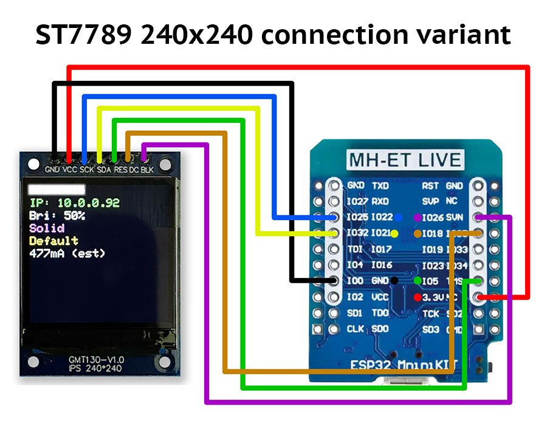
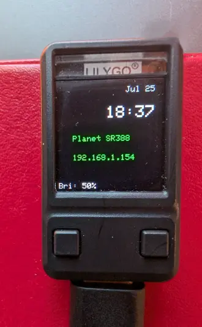

# Using a TFT pixel color display with ESP32 boards

This usermod enables display of the following:

* Current date and time;
* Network SSID;
* IP address;
* WiFi signal strength;
* Brightness;
* Selected effect;
* Selected palette;
* Effect speed and intensity;
* Estimated current in mA;

## Hardware

This mod has been developed for two configurations:

Connected ST7789 dev board:


The built in display in the [LILYGO T-QT Pro](https://www.lilygo.cc/products/t-qt-pro):


It should be relatively easy to support other displays, though the positioning of the text may need to be adjusted.

## Library used

[Bodmer/TFT_eSPI](https://github.com/Bodmer/TFT_eSPI)

## Setup

***

### platformio_override.ini

Copy and update the example `platformio_override.ini.sample` to the root directory of your particular build (renaming it `platformio_override.ini`).
This file should be placed in the same directory as `platformio.ini`. This file is set up for the [LILYGO T-QT Pro](https://www.lilygo.cc/products/t-qt-pro). Specifically, the 8MB flash version. See the next section for notes on setting the build flags. For other boards, you may want to use a different environment as the basis.

### Manual Platformio.ini changes

In the `platformio.ini` file, uncomment the `TFT_eSPI` line within the [common] section, under `lib_deps`:

```ini
# platformio.ini
...
[common]
...
lib_deps =
    ...
  #For use of the TTGO T-Display ESP32 Module with integrated TFT display uncomment the following line  
    #TFT_eSPI
...
```

In the `platformio.ini` file, you must change the environment setup for the environment you're building for:

Add the following flags to relevant `build_flags` section:

```ini
# Enable the mod
-D USERMOD_TFT_DISPLAY
# (Optional) Set this parameter to rotate the display. 1-3 rotate by 90,180,270 degrees.
# Can also be adjusted in the UI
-D USERMOD_TFT_DISPLAY_ROTATION=0
# (Optional) The font size. 1 is suitable for a 128x128 screen, 2 is suitable for a 240x240 screen. (default=2)
# Can also be adjusted in the UI
-D USERMOD_TFT_DISPLAY_SCALE=2
# (Optional) How often should the mod check for updates in milliseconds (1000)
-D USERMOD_TFT_DISPLAY_REFRESH_RATE_MS=1000
# (Optional) How long without changes before the backlight turns off (default=5 minutes)
# NOTE: If NTP is enabled, screen updates every minute
-D USERMOD_TFT_DISPLAY_TIMEOUT_MS=3000000
# (Optional) Set this flag to make the BL pin active low
-D USERMOD_TFT_DISPLAY_BL_ACTIVE_LOW
```

In addition to the flags used by the usermod, you need to properly configure the flags used by [Bodmer/TFT_eSPI](https://github.com/Bodmer/TFT_eSPI) to configure the particular display you want to use. For example for a 240x240 ST7789 Display
```ini
build_flags = ${common.build_flags_esp32}
    -D USERMOD_TFT_DISPLAY
    -DUSER_SETUP_LOADED=1
    -DST7789_DRIVER=1
    -DTFT_WIDTH=240
    -DTFT_HEIGHT=240
    -DCGRAM_OFFSET=1
    -DTFT_MOSI=21
    -DTFT_SCLK=22
    -DTFT_DC=27
    -DTFT_RST=26
    -DTFT_BL=14
    -DLOAD_GLCD=1
    ;optional for WROVER
    ;-DCONFIG_SPIRAM_SUPPORT=1
```

Save the `platformio.ini` file, and perform the desired build.

### TFT_eSPI Library Adjustments

If you are not using PlatformIO, you need to modify a file in the `TFT_eSPI` library. You'll need to find the library downloaded manually or through another the Arduino IDE.

See <https://github.com/Bodmer/TFT_eSPI?tab=readme-ov-file#tips> for instructions.

## Configuration

This mod has two configurable values:
 * rotation - Set this parameter to rotate the display.
 * text_size - The font size. 1 is suitable for a 128x128 screen, 2 is suitable for a 240x240 screen.

The configuration also includes the pins configured in the TFT build flags. These are just so the UI recognizes that these pins are being used. The [Bodmer/TFT_eSPI](https://github.com/Bodmer/TFT_eSPI) requires that these are set at build time and changing these values is ignored.
