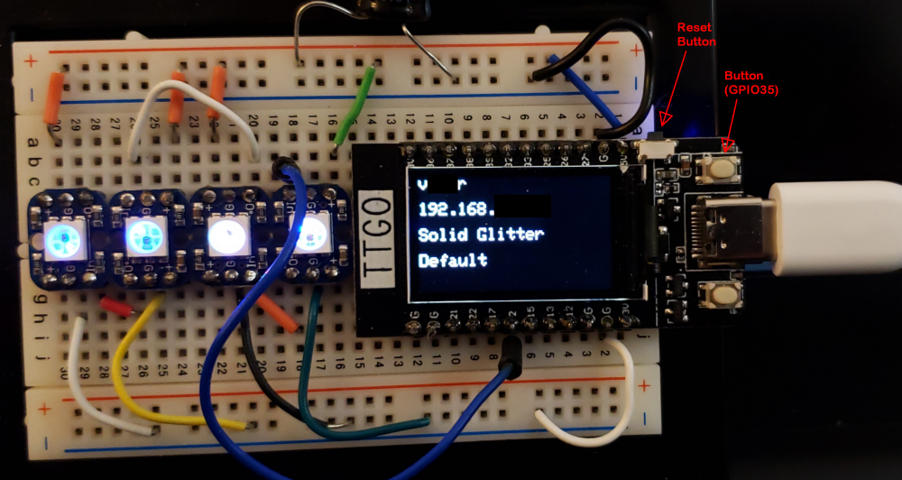
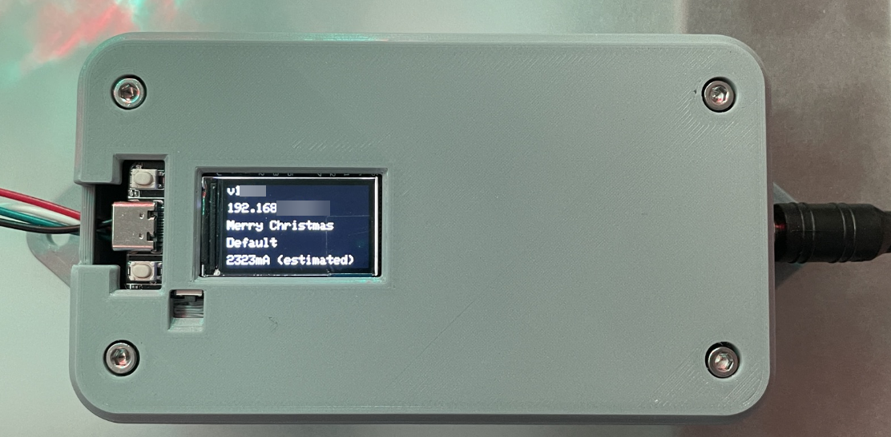
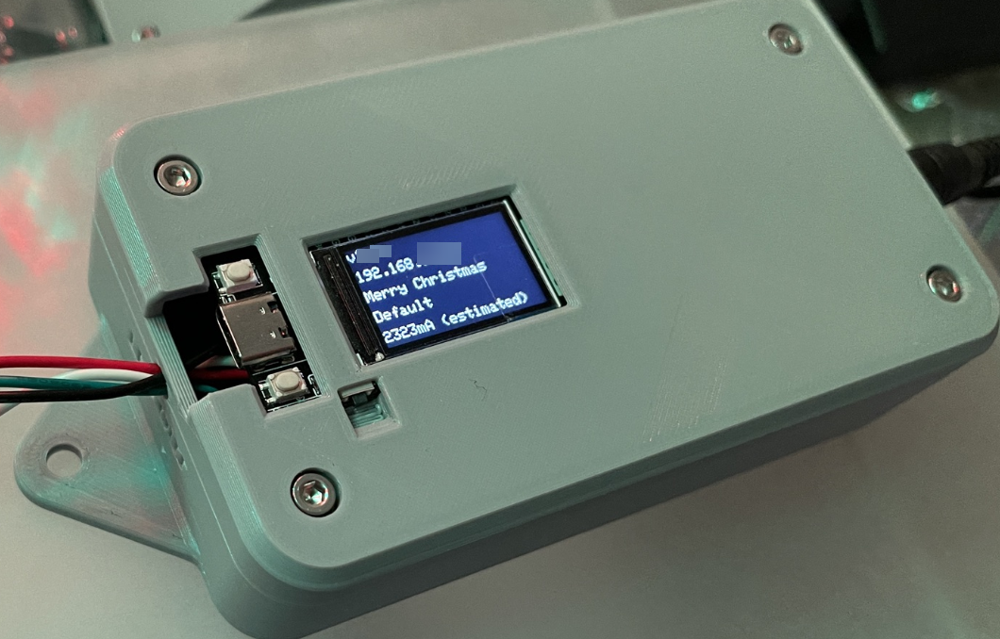
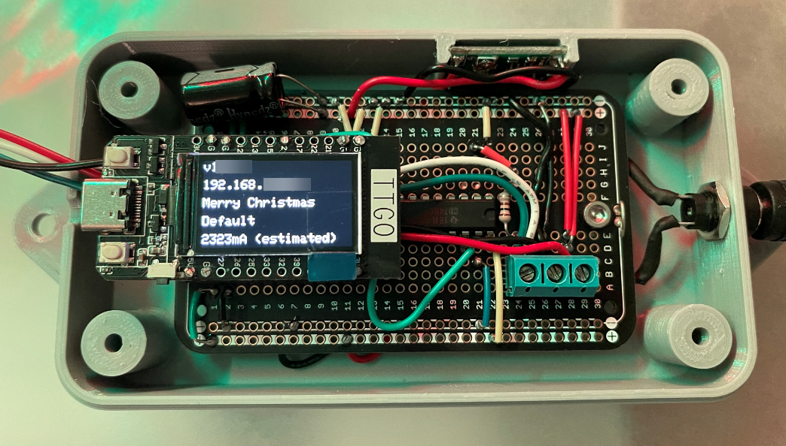

# TTGO T-Display ESP32 with 240x135 TFT via SPI with TFT_eSPI
This usermod allows use of the TTGO T-Display ESP32 module with integrated 240x135 display
for controlling WLED and showing the following information: 
* Current SSID
* IP address if obtained
  * If connected to a network, current brightness % is shown 
  * in AP mode AP IP and password are shown
* Current effect
* Current palette
* Estimated current in mA is shown (NOTE: for this to be a reasonable value, the correct LED type must be specified in the LED Prefs section)

Button pin is mapped to the onboard button next to the side actuated reset button of the TTGO T-Display board.

I have designed a 3D printed case around this board and an ["ElectroCookie"](https://amzn.to/2WCNeeA) project board, a [level shifter](https://amzn.to/3hbKu18), a [buck regulator](https://amzn.to/3mLMy0W), and a DC [power jack](https://amzn.to/3phj9NZ).  I use 12V WS2815 LED strips for my projects, and power them with 12V power supplies, so the regulator drops the voltage to the 5V level I need to power the ESP module and the level shifter.  If there is any interest in this case, which elevates the board and display on some custom extended headers to make place the screen at the top of the enclosure (with accessible buttons), let me know, and I could post the STL files.  It is a bit tricky to get the height correct, so I also designed a one-time use 3D printed solder fixture to set the board in the right location and at the correct height for the housing.  (It is one-time use because it has to be cut off after soldering to be able to remove it).  I didn't think the effort to make it in multiple pieces was worthwhile.

Usermod based on a rework of the ssd1306_i2c_oled_u8g2 usermod from the WLED repo.

## Hardware






## Github reference for TTGO-Tdisplay

* [TTGO T-Display](https://github.com/Xinyuan-LilyGO/TTGO-T-Display)

## Requirements
Functionality checked with:
* TTGO T-Display
* PlatformIO
* Group of 4 individual Neopixels from Adafruit, and a several full strings of 12v WS2815 LEDs.
* The hardware design shown above should be limited to shorter strings.  For larger strings, I use a different setup with a dedicated 12v power supply and power them directly off the supply (in addition to dropping the 12v supply down to 5v with a buck regulator for the ESP module and level shifter).

## Setup Needed:
* As with all usermods, copy the usermod.cpp file from the TTGO-T-Display usermod folder to the wled00 folder (replacing the default usermod.cpp file).

## Platformio Requirements
### Platformio.ini changes
Under the root folder of the project, in the `platformio.ini` file, uncomment the `TFT_eSPI` line within the [common] section, under `lib_deps`:
```ini
# platformio.ini
...
[common]
...
lib_deps =
    ...
  #For use of the TTGO T-Display ESP32 Module with integrated TFT display uncomment the following line  
    #TFT_eSPI
...
```

Also, while in the `platformio.ini` file, you must change the environment setup to build for just the esp32dev platform as follows:

Comment out the line described below:
```ini
# Travis CI binaries (comment this out when building for single board)
; default_envs = travis_esp8266, esp01, esp01_1m_ota, travis_esp32
```
and UNCOMMENT the following line in the 'Single binaries' section:
```ini
default_envs = esp32dev
```
Save the `platformio.ini` file.  Once this is saved, the required library files should be automatically downloaded for modifications in a later step.

### Platformio_overrides.ini (added)
Copy the `platformio_overrides.ini` file which is contained in the `usermods/TTGO-T-Display/` folder into the root of your project folder. This file contains an override that remaps the button pin of WLED to use the on-board button to the right of the USB-C connector (when viewed with the port oriented downward - see hardware photo).

### TFT_eSPI Library Adjustments (board selection)
We need to modify a file in the `TFT_eSPI` library to select the correct board.  If you followed the directions to modify and save the `platformio.ini` file above, the `User_Setup_Select.h` file can be found in the `/.pio/libdeps/esp32dev/TFT_eSPI_ID1559` folder.

Modify the  `User_Setup_Select.h` file as follows:
* Comment out the following line (which is the 'default' setup file):
```ini
//#include <User_Setup.h>           // Default setup is root library folder
```
* Uncomment the following line (which points to the setup file for the TTGO T-Display):
```ini
#include <User_Setups/Setup25_TTGO_T_Display.h>    // Setup file for ESP32 and TTGO T-Display ST7789V SPI bus TFT
```

Run the build and it should complete correctly.  If you see a failure like this:
```ini
xtensa-esp32-elf-g++: error: wled00\wled00.ino.cpp: No such file or directory
xtensa-esp32-elf-g++: fatal error: no input files
```
Just try building again - I find that sometimes this happens on the first build attempt and subsequent attempts will build correctly.

## Arduino IDE
- UNTESTED