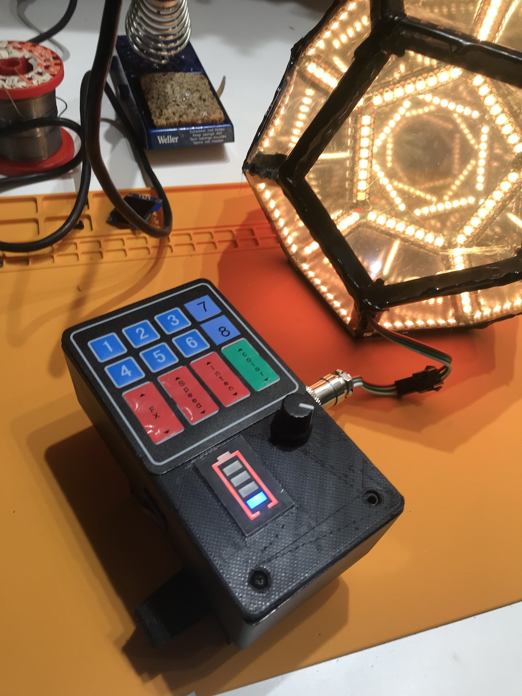
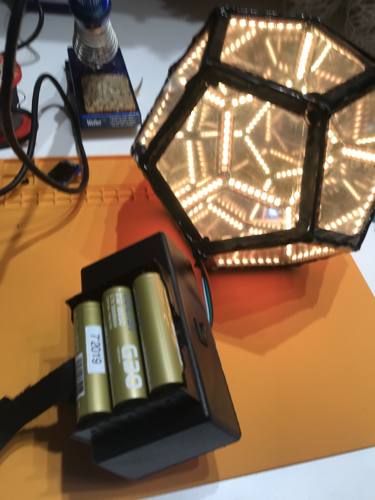
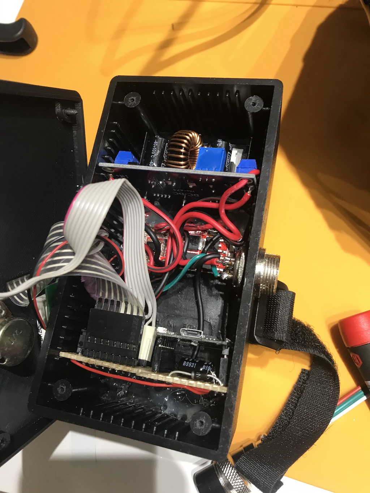

# Battery powered controller with keypad

I'm using this controller for a festival totem. Runs on 3 18650 Cells, can deliver >5A current.

Via keypad one can select 8 presets, change effect, effect speed, effect intensity and palette. Brightness can be
adjusted with a potentiometer.

## Pictures

