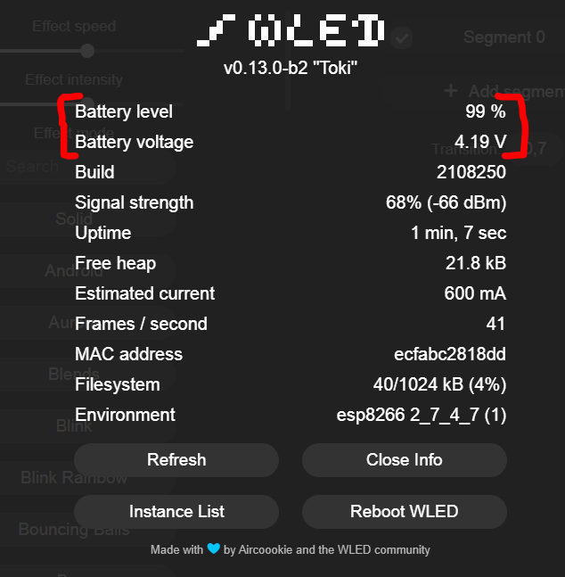

# :battery: Battery status/level Usermod :battery:
Enables battery level monitoring of your project.

You can see the battery level and voltage in the `info modal`. 

For this to work, the positive side of the (18650) battery must be connected to pin `A0` of the d1 mini/esp8266 with a 100k Ohm resistor (see [Useful Links](#useful-links)).

If you have an ESP32 board, connect the positive side of the battery to ADC1 (GPIO32 - GPIO39)

  

## Installation

define `USERMOD_BATTERY_STATUS_BASIC` in `my_config.h`

### Basic wiring diagram

  

### Define Your Options

* `USERMOD_BATTERY_STATUS_BASIC`                   - define this (in `my_config.h`) to have this usermod included wled00\usermods_list.cpp
* `USERMOD_BATTERY_MEASUREMENT_PIN`                - defaults to A0 on ESP8266 and GPIO32 on ESP32
* `USERMOD_BATTERY_MEASUREMENT_INTERVAL`           - battery check interval. defaults to 30 seconds
* `USERMOD_BATTERY_MIN_VOLTAGE`                    - minimum battery voltage. default is 2.6 (18650 battery standard)
* `USERMOD_BATTERY_MAX_VOLTAGE`                    - maximum battery voltage. default is 4.2 (18650 battery standard)

All parameters can be configured at runtime via the Usermods settings page.

## Important :warning:
* Make sure you know your battery specifications! All batteries are **NOT** the same!
* Example:

| Your battery specification table  |                 | Options you can define        | 
| :-------------------------------- |:--------------- | :---------------------------- |
| Capacity                          | 3500mAh 12,5 Wh |                               |
| Minimum capacity                  | 3350mAh 11,9 Wh |                               |
| Rated voltage                     | 3.6V - 3.7V     |                               |
| **Charging end voltage**          | **4,2V ± 0,05** | `USERMOD_BATTERY_MAX_VOLTAGE` |
| **Discharge voltage**             | **2,5V**        | `USERMOD_BATTERY_MIN_VOLTAGE` |
| Max. discharge current (constant) | 10A (10000mA)   |                               |
| max. charging current             | 1.7A (1700mA)   |                               |
| ...                               | ...             | ...                           |
| ..                                | ..              | ..                            |

Specification from:  [Molicel INR18650-M35A, 3500mAh 10A Lithium-ion battery, 3.6V - 3.7V](https://www.akkuteile.de/lithium-ionen-akkus/18650/molicel/molicel-inr18650-m35a-3500mah-10a-lithium-ionen-akku-3-6v-3-7v_100833)

## Useful Links
* https://lazyzero.de/elektronik/esp8266/wemos_d1_mini_a0/start
* https://arduinodiy.wordpress.com/2016/12/25/monitoring-lipo-battery-voltage-with-wemos-d1-minibattery-shield-and-thingspeak/

## Change Log
2021-09-02
* added "Battery voltage" to info
* added circuit diagram to readme
* added MQTT support, sending battery voltage
* minor fixes

2021-08-15
* changed `USERMOD_BATTERY_MIN_VOLTAGE` to 2.6 volt as default for 18650 batteries
* Updated readme, added specification table

2021-08-10
* Created

