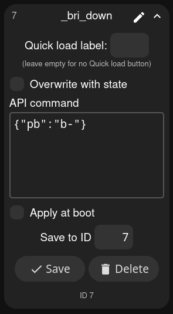
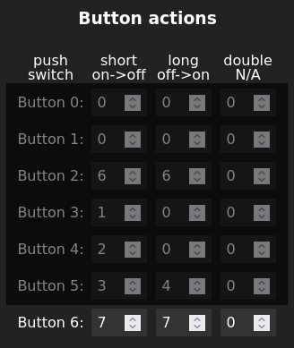

# Perceptual Brightness usermod

This usermod lets you make changes to the brightness in 'steps' that are evenly spaced to the human eye.

Our eyes are logarithmic, meaning that the same absolute change when the intensity is low (eg, changing from brightness setting 10 to 20) seems much higher to us than when the intensity is high (eg, changing from 210 to 220). For brightness to change in perceptually even steps, the steps must be small at the bottom end of the brightness range and become larger.

It's easy to apply this usermod for a single button control of global WLED brightness, or for up/down buttons. It can also be used with external calls from Home Assistant or other API-based interfaces.

## Brightness steps
Once you enable the usermod (be sure to check the 'enable' button), you can choose how many brightness steps should be computed, as well as how many steps to skip at the start and end.

Note the computed steps, listed in the bottom of the example above. The spacing increases gradually as the brightness goes up. In practice, cycling through these levels looks about linear to the eye.

Also note the start skip of 3 means the first 3 values are outside the square brackets: they will be ignored when using this usermod. The end skip of 2 is also demonstrated, limiting the maximum brightness to 170, but you could also achieve this by setting the max brightness at the top to 170 and computing fewer steps.

This usermod allows for multiple ways to move up or down along these brightness steps, described below.

## Up and down buttons
Sending an API command of `{"pb":"+"}` will move from the current brightness step to the next higher brightness step. In the example above, if WLED's global brightness is at brightness of 21, it will increase to 31.

Lowering the brightness uses the API command `{"pb":"-"}`

You can create presets with these two API commands (uncheck the "use current state" when saving a new preset to enter an API command) and test them by clicking on those presets in the web UI. I use the names `_bri_up` and `_bri_down` but you can call them whatever you'd like.

You can then apply these commands as button actions for both "short" and "long" actions by typing the preset ID into those boxes under *Settings>Time & Macros>Button Actions*, as shown below.

## Single button for brightness cycling
For a single button, a command is provided that goes between brightness steps in a single direction, or after a sort pause, will start changing in the other direction. This works great for a single button. That API command is `{"pb":"/"}` and you can assign this to a button exactly as the up and down buttons described earlier.

A variation of that command will loop back in the other direction even without the button being released. It starts cycling down once the max brightness is reached, and up again once the minimum brightness is reached. You use the API command `{"pb":"~"}` for the looping variation.

## Brightness changing speed
When holding down buttons, `WLED_LONG_REPEATED_ACTION` is the variable that defines how long it takes to call the command again with buttons, by default 400ms. You can customize this with a build flag such as `-D WLED_LONG_REPEATED_ACTION=500`, and you can also play around with the number of brightness steps.

## Other changes to brightness
This usermod doesn't keep track of changes made to brightness outside of these API commands. You can still change the brightness in other ways (eg, presets with `bri` specified, or changes to the brightness slider in the web UI), but when you use an increment/decrement/cycling command as described in this page, the usermod will proceed from the brightness step you last reached using those API commands.
