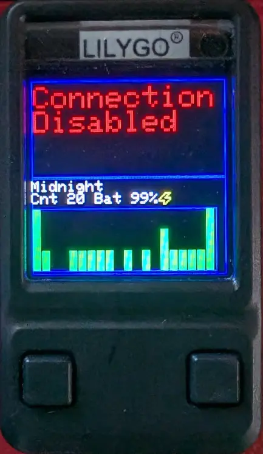
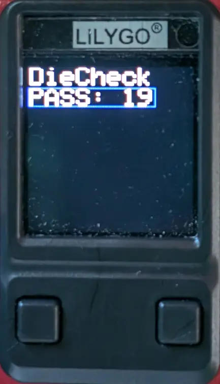
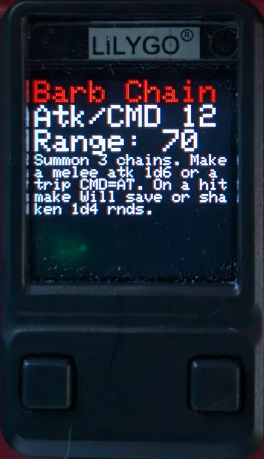
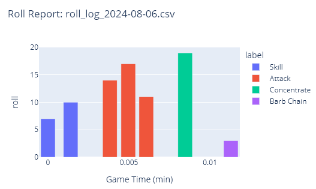

# A mod for using Pixel Dice with ESP32S3 boards

A usermod to connect to and handle rolls from [Pixels Dice](https://gamewithpixels.com/). WLED acts as both an display controller, and a gateway to connect the die to the Wifi network.

High level features:

* Several LED effects that respond to die rolls
  * Effect color and parameters can be modified like any other effect
  * Different die can be set to control different segments
* An optional GUI on a TFT screen with custom button controls
  * Gives die connection and roll status
  * Can do basic LED effect controls
  * Can display custom info for different roll types (ie. RPG stats/spell info)
* Publish MQTT events from die rolls
  * Also report the selected roll type
* Control settings through the WLED web

See <https://www.robopenguins.com/pixels-dice-box/> for a write up of the design process of the hardware and software I used this with.

I also set up a custom web installer for the usermod at <https://axlan.github.io/WLED-WebInstaller/> for 8MB ESP32-S3 boards.

## Table of Contents

<!-- TOC start (generated with https://github.com/derlin/bitdowntoc) -->
* [Demos](#demos)
  + [TFT GUI](#tft-gui)
  + [Multiple Die Controlling Different Segments](#multiple-die-controlling-different-segments)
* [Hardware](#hardware)
* [Library used](#library-used)
* [Compiling](#compiling)
  + [platformio_override.ini](#platformio_overrideini)
  + [Manual platformio.ini changes](#manual-platformioini-changes)
* [Configuration](#configuration)
  + [Controlling Dice Connections](#controlling-dice-connections)
  + [Controlling Effects](#controlling-effects)
      - [DieSimple](#diesimple)
      - [DiePulse](#diepulse)
      - [DieCheck](#diecheck)
* [TFT GUI](#tft-gui-1)
  + [Status](#status)
  + [Effect Menu](#effect-menu)
  + [Roll Info](#roll-info)
* [MQTT](#mqtt)
* [Potential Modifications and Additional Features](#potential-modifications-and-additional-features)
* [ESP32 Issues](#esp32-issues)
<!-- TOC end -->

<!-- TOC --><a name="demos"></a>
## Demos

<!-- TOC --><a name="tft-gui"></a>
### TFT GUI
[](https://youtu.be/VNsHq1TbiW8)

<!-- TOC --><a name="multiple-die-controlling-different-segments"></a>
### Multiple Die Controlling Different Segments
[](https://youtu.be/oCDr44C-qwM)

<!-- TOC --><a name="hardware"></a>
## Hardware

The main purpose of this mod is to support [Pixels Dice](https://gamewithpixels.com/). The board acts as a BLE central for the dice acting as peripherals. While any ESP32 variant with BLE capabilities should be able to support this usermod, in practice I found that the original ESP32 did not work. See [ESP32 Issues](#esp32-issues) for a deeper dive.

The only other ESP32 variant I tested was the ESP32-S3, which worked without issue. While there's still concern over the contention between BLE and WiFi for the radio, I haven't noticed any performance impact in practice. The only special behavior that was needed was setting `noWifiSleep = false;` to allow the OS to sleep the WiFi when the BLE is active.

In addition, the BLE stack requires a lot of flash. This build takes 1.9MB with the TFT code, or 1.85MB without it. This makes it too big to fit in the `tools/WLED_ESP32_4MB_256KB_FS.csv` partition layout, and I needed to make a `WLED_ESP32_4MB_64KB_FS.csv` to even fit on 4MB devices. This only has 64KB of file system space, which is functional, but users with more than a handful of presets would run into problems with 64KB only. This means that while 4MB can be supported, larger flash sizes are needed for full functionality. 

The basic build of this usermod doesn't require any special hardware. However, the LCD status GUI was specifically designed for the [LILYGO T-QT Pro](https://www.lilygo.cc/products/t-qt-pro).

It should be relatively easy to support other displays, though the positioning of the text may need to be adjusted.

<!-- TOC --><a name="library-used"></a>
## Library used

[axlan/pixels-dice-interface](https://github.com/axlan/arduino-pixels-dice)

Optional: [Bodmer/TFT_eSPI](https://github.com/Bodmer/TFT_eSPI)

<!-- TOC --><a name="compiling"></a>
## Compiling

<!-- TOC --><a name="platformio_overrideini"></a>
### platformio_override.ini

Copy and update the example `platformio_override.ini.sample` to the root directory of your particular build (renaming it `platformio_override.ini`).
This file should be placed in the same directory as `platformio.ini`. This file is set up for the [LILYGO T-QT Pro](https://www.lilygo.cc/products/t-qt-pro). Specifically, the 8MB flash version. See the next section for notes on setting the build flags. For other boards, you may want to use a different environment as the basis.

<!-- TOC --><a name="manual-platformioini-changes"></a>
### Manual platformio.ini changes

Using the `platformio_override.ini.sample` as a reference, you'll need to update the `build_flags` and `lib_deps` of the target you're building for.

If you don't need the TFT GUI, you just need to add 


```ini
...
build_flags =
  ...
  -D USERMOD_PIXELS_DICE_TRAY ;; Enables this UserMod
lib_deps =
  ...
  ESP32 BLE Arduino
  axlan/pixels-dice-interface @ 1.2.0
...
```

For the TFT support you'll need to add `Bodmer/TFT_eSPI` to `lib_deps`, and all of the required TFT parameters to `build_flags` (see `platformio_override.ini.sample`).

Save the `platformio.ini` file, and perform the desired build.

<!-- TOC --><a name="configuration"></a>
## Configuration

In addition to configuring which dice to connect to, this mod uses a lot of the built in WLED features:
* The LED segments, effects, and customization parameters
* The buttons for the UI
* The MQTT settings for reporting the dice rolls

<!-- TOC --><a name="controlling-dice-connections"></a>
### Controlling Dice Connections

**NOTE:** To configure the die itself (set its name, the die LEDs, etc.), you still need to use the Pixels Dice phone App.

The usermods settings page has the configuration for controlling the dice and the display:
 * Ble Scan Duration - The time to look for BLE broadcasts before taking a break
 * Rotation - If display used, set this parameter to rotate the display.

The main setting here though are the Die 0 and 1 settings. A slot is disabled if it's left blank. Putting the name of a die will make that slot only connect to die with that name. Alteratively, if the name is set to `*` the slot will use the first unassociated die it sees. Saving the configuration while a wildcard slot is connected to a die will replace the `*` with that die's name.

**NOTE:** The slot a die is in is important since that's how they're identified for controlling LED effects. Effects can be set to respond to die 0, 1, or any.

The configuration also includes the pins configured in the TFT build flags. These are just so the UI recognizes that these pins are being used. The [Bodmer/TFT_eSPI](https://github.com/Bodmer/TFT_eSPI) requires that these are set at build time and changing these values is ignored.

<!-- TOC --><a name="controlling-effects"></a>
### Controlling Effects

The die effects for rolls take advantage of most of the normal WLED effect features: <https://kno.wled.ge/features/effects/>.

If you have different segments, they can have different effects driven by the same die, or different dice.

<!-- TOC --><a name="diesimple"></a>
#### DieSimple
Turn off LEDs while rolling, than light up solid LEDs in proportion to die roll.

* Color 1 - Selects the "good" color that increases based on the die roll
* Color 2 - Selects the "background" color for the rest of the segment
* Custom 1 - Sets which die should control this effect. If the value is greater then 1, it will respond to both dice.

<!-- TOC --><a name="diepulse"></a>
#### DiePulse
Play `breath` effect while rolling, than apply `blend` effect in proportion to die roll.

* Color 1 - See `breath` and `blend`
* Color 2 - Selects the "background" color for the rest of the segment
* Palette - See `breath` and `blend`
* Custom 1 - Sets which die should control this effect. If the value is greater then 1, it will respond to both dice.

<!-- TOC --><a name="diecheck"></a>
#### DieCheck
Play `running` effect while rolling, than apply `glitter` effect if roll passes threshold, or `gravcenter` if roll is below.

* Color 1 - See `glitter` and `gravcenter`, used as first color for `running`
* Color 2 - See `glitter` and `gravcenter`
* Color 3 - Used as second color for `running`
* Palette - See `glitter` and `gravcenter`
* Custom 1 - Sets which die should control this effect. If the value is greater then 1, it will respond to both dice.
* Custom 2 - Sets the threshold for success animation. For example if 10, success plays on rolls of 10 or above.

<!-- TOC --><a name="tft-gui-1"></a>
## TFT GUI

The optional TFT GUI currently supports 3 "screens":
1. Status
2. Effect Control
3. Roll Info

Double pressing the right button goes forward through the screens, and double pressing left goes back (with rollover).

<!-- TOC --><a name="status"></a>
### Status


Shows the status of each die slot (0 on top and 1 on the bottom).

If a die is connected, its roll stats and battery status are shown. The rolls will continue to be tracked even when viewing other screens.

Long press either button to clear the roll stats.

<!-- TOC --><a name="effect-menu"></a>
### Effect Menu


Allows limited customization of the die effect for the currently selected LED segment.

The left button moves the cursor (blue box) up and down the options for the current field.

The right button updates the value for the field. 

The first field is the effect. Updating it will switch between the die effects.

The DieCheck effect has an additional field "PASS". Pressing the right button on this field will copy the current face up value from the most recently rolled die.

Long pressing either value will set the effect parameters (color, palette, controlling dice, etc.) to a default set of values.

<!-- TOC --><a name="roll-info"></a>
### Roll Info


Sets the "roll type" reported by MQTT events and can show additional info.

Pressing the right button goes forward through the rolls, and double pressing left goes back (with rollover).

The names and info for the rolls are generated from the `usermods/pixels_dice_tray/generate_roll_info.py` script. It updates `usermods/pixels_dice_tray/roll_info.h` with code generated from a simple markdown language.

<!-- TOC --><a name="mqtt"></a>
## MQTT

See <https://kno.wled.ge/interfaces/mqtt/> for general MQTT configuration for WLED.

The usermod produces two types of events

* `$mqttDeviceTopic/dice/roll` - JSON that reports each die roll event with the following keys.
  - name - The name of the die that triggered the event
  - state - Integer indicating the die state `[UNKNOWN = 0, ON_FACE = 1, HANDLING = 2, ROLLING = 3, CROOKED = 4]`
  - val - The value on the die's face. For d20 1-20
  - time - The uptime timestamp the roll was received in milliseconds. 
* `$mqttDeviceTopic/dice/roll_label` - A string that indicates the roll type selected in the [Roll Info](#roll-info) TFT menu.

Where `$mqttDeviceTopic` is the topic set in the WLED MQTT configuration.

Events can be logged to a CSV file using the script `usermods/pixels_dice_tray/mqtt_client/mqtt_logger.py`. These can then be used to generate interactive HTML plots with `usermods/pixels_dice_tray/mqtt_client/mqtt_plotter.py`.



<!-- TOC --><a name="potential-modifications-and-additional-features"></a>
## Potential Modifications and Additional Features

This usermod is in support of a particular dice box project, but it would be fairly straightforward to extend for other applications.
* Add more dice - There's no reason that several more dice slots couldn't be allowed. In addition LED effects that use multiple dice could be added (e.g. a contested roll).
* Better support for die other then d20's. There's a few places where I assume the die is a d20. It wouldn't be that hard to support arbitrary die sizes.
* TFT Menu - The menu system is pretty extensible. I put together some basic things I found useful, and was mainly limited by the screen size.
* Die controlled UI - I originally planned to make an alternative UI that used the die directly. You'd press a button, and the current face up on the die would trigger an action. This was an interesting idea, but didn't seem to practical since I could more flexibly reproduce this by responding to the dice MQTT events.

<!-- TOC --><a name="esp32-issues"></a>
## ESP32 Issues

I really wanted to have this work on the original ESP32 boards to lower the barrier to entry, but there were several issues.

First there are the issues with the partition sizes for 4MB mentioned in the [Hardware](#hardware) section.

The bigger issue is that the build consistently crashes if the BLE scan task starts up. It's a bit unclear to me exactly what is failing since the backtrace is showing an exception in `new[]` memory allocation in the UDP stack. There appears to be a ton of heap available, so my guess is that this is a synchronization issue of some sort from the tasks running in parallel. I tried messing with the task core affinity a bit but didn't make much progress. It's not really clear what difference between the ESP32S3 and ESP32 would cause this difference.

At the end of the day, its generally not advised to run the BLE and Wifi at the same time anyway (though it appears to work without issue on the ESP32S3). Probably the best path forward would be to switch between them. This would actually not be too much of an issue, since discovering and getting data from the die should be possible to do in bursts (at least in theory).
