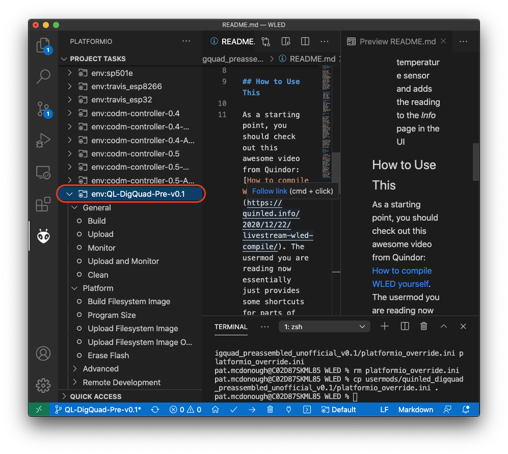
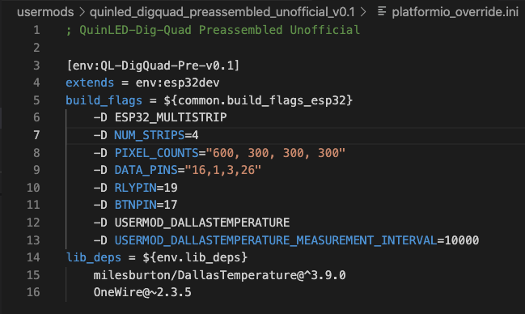
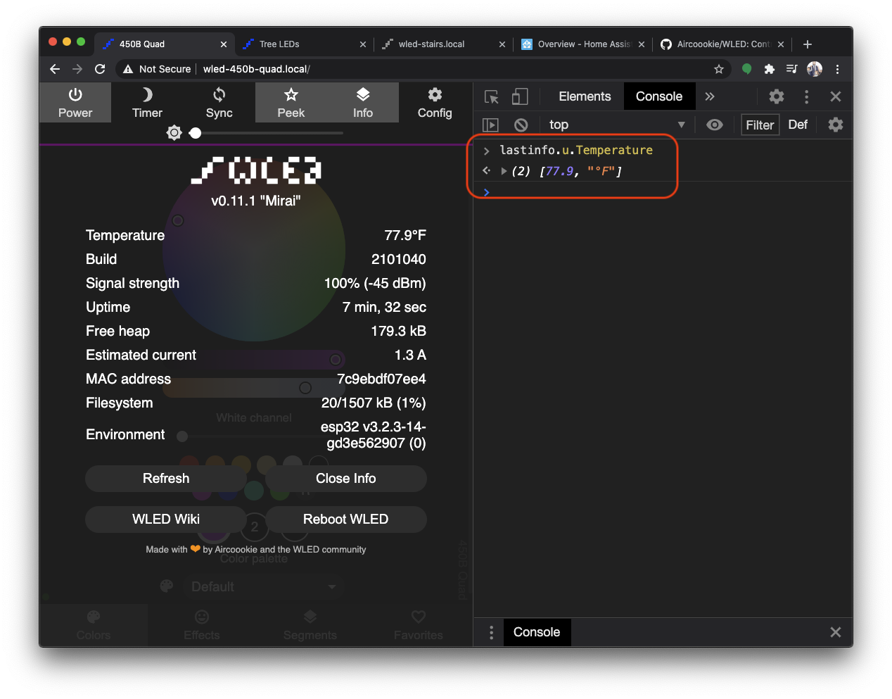

# QuinLED-Dig-Quad Preassembled Unofficial Build

This usermod targets the [Preassembled QuinLED-Dig-Quad](https://quinled.info/pre-assembled-quinled-dig-quad/). Tested on board revision v1r6b,
and includes the following features:

 * **Multi-channel Support** - enabling use of LED1, LED2, LED3, LED4 pins to work using segments
 * **Temperature Sensor Support** - pulls readings from the built-in temperature sensor and adds the reading to the *Info* page in the UI

## Background

As a starting point, you should check out this awesome video from Quindor: [How to compile WLED yourself](https://quinled.info/2020/12/22/livestream-wled-compile/). The usermod you are reading now just provides some shortcuts for parts of what were covered in that video.

## Build Firmware with Multi-channel and Temp Support

1. Copy the `platformio_override.ini` file to the project's root directory
1. If using VS Code with the PlatformIO plugin like in the video, you will now see this new project task listed in the PLATFORMIO panel at the bottom as `env:QL-DigQuad-Pre-v0.1` (you probably need to hit the refresh button) 

   

1. Edit this file from the root directory as needed:

   

   * `PIXEL_COUNTS` may need to be adjusted for your set-up. E.g. I have lots of LEDs in Channel 1, but that's probably unusual for most
   * `DATA_PINS` may need to be changed to "16,3,1,26" instead of "16,1,3,26" apparently depending on the board revision or some such

1. Build the mod (e.g. click `Build` from the project task circled above) and update your firmware using the `QL-DigQuad-Pre-v0.1` file, e.g. using _Manual OTA_ from the Config menu. Based on the video and my own experience, you might need to build twice 🤷‍♂️.

## Observing Temperature

Hopefully you can now see the Temperature listed in the Info page. If not, use Chrome Developer Tools to find the current temperature

1. Open the Developer Tools Console
2. Enter `lastinfo.u.Temperature` to view the Temperature array

   

