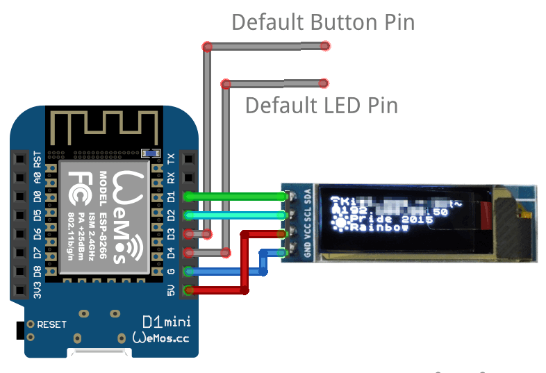

# SSD1306 128x32 OLED via I2C with u8g2
This usermod allows to connect 128x32 Oled display to WLED controlled and show 
the next information:
- Current SSID
- IP address if obtained
  * in AP mode and turned off lightning AP password is shown
- Current effect
- Current palette
- On/Off icon (sun/moon)

## Hardware


## Requirements
Functionality checked with:
- commit 095429a7df4f9e2b34dd464f7bbfd068df6558eb
- Wemos d1 mini
- PlatformIO
- Generic SSD1306 128x32 I2C OLED display from aliexpress

### Platformio
Add `U8g2@~2.27.2` dependency to `lib_deps_external` under `[common]` section in `platformio.ini`:
```ini
# platformio.ini
...
[common]
...
lib_deps_external =
  ...
  U8g2@~2.27.2
...
```

### Arduino IDE
Install library `U8g2 by oliver`  in `Tools | Include Library | Manage libraries` menu.